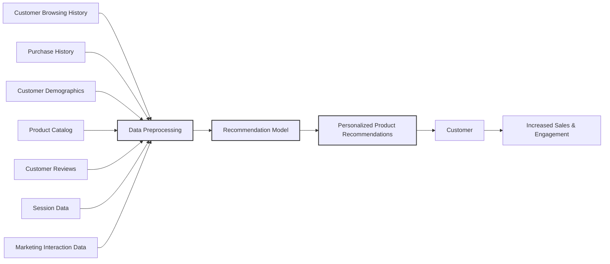
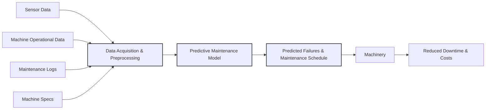
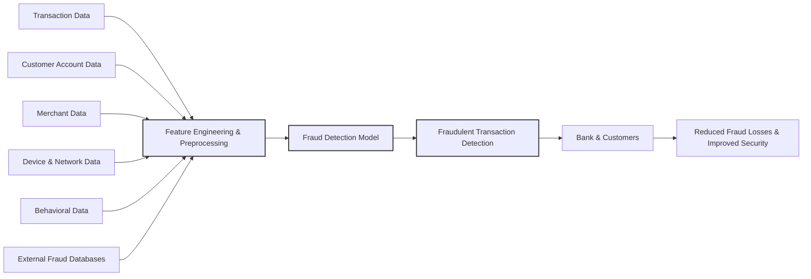
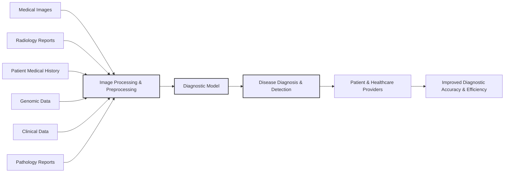
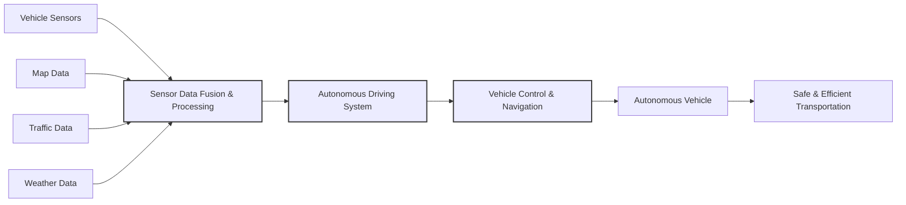
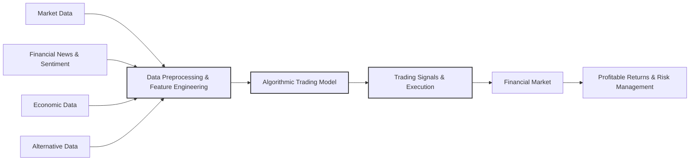

## Assignment 1: AI and ML Use Cases Across Domains

Here's a breakdown for each domain, focusing on Data, Problem Statement, and related points.

---

### 1. Ecommerce

**Use Case:** **Personalized Product Recommendations**

**Data:**

*   **Data Sources:**
    *   **Customer Browsing History:** Website clicks, pages viewed, products searched, time spent on pages.
    *   **Purchase History:** Past orders, items purchased, order frequency, order value.
    *   **Customer Demographics:** Age, gender, location (if available and consented to), potentially interests declared in profiles.
    *   **Product Catalog:** Product descriptions, categories, attributes (color, size, price, brand, etc.), images.
    *   **Customer Reviews and Ratings:** Textual reviews, star ratings for products.
    *   **Session Data:**  User sessions, devices used, time of day browsing.
    *   **Marketing Interaction Data:** Email opens, click-throughs, ad clicks, social media interactions.

*   **Data Issues:**
    *   **Data Sparsity:** Many users might have limited browsing or purchase history, especially new users.
    *   **Data Volume & Velocity:** Ecommerce platforms generate massive amounts of data in real-time.
    *   **Data Privacy:**  Handling customer data responsibly and complying with privacy regulations (GDPR, CCPA etc.).
    *   **Data Quality:** Inconsistent product descriptions, missing attributes, inaccurate customer demographics (if self-reported).
    *   **Cold Start Problem:** Recommending products to new users with no history.
    *   **Dynamic Preferences:** Customer tastes and preferences can change over time.

*   **Types of Data:**
    *   **Structured Data:** Customer demographics, purchase history (transactional data), product catalog (attributes), ratings. (Tables, Databases)
    *   **Unstructured Data:** Customer reviews (text), product images, browsing session data (logs - semi-structured but analyzed as unstructured in many cases).

**Problem Statement:**

*   **Problem:** How to improve customer engagement and increase sales revenue on an e-commerce platform by providing highly relevant and personalized product recommendations to each user in real-time.  Current recommendation methods might be too generic, leading to low click-through rates and missed sales opportunities.

*   **Implications of Solving using AI/ML:**
    *   **Increased Sales:**  More relevant recommendations lead to higher click-through rates, add-to-cart rates, and ultimately, more purchases.
    *   **Improved Customer Experience:** Customers discover products they are genuinely interested in, leading to higher satisfaction and loyalty.
    *   **Enhanced Customer Lifetime Value:** By consistently providing value and relevant recommendations, customers are more likely to return and make repeat purchases.
    *   **Reduced Marketing Costs:** Targeted recommendations can be more efficient than broad marketing campaigns.

*   **Tradeoffs:**
    *   **Complexity & Computational Cost:** Building and deploying sophisticated recommendation models (e.g., deep learning based) can be computationally intensive and require significant infrastructure.
    *   **Interpretability vs. Accuracy:**  Complex models (like deep learning) might provide higher accuracy but are often less interpretable (black box). Simpler models like collaborative filtering are more interpretable but might have lower accuracy.
    *   **Data Privacy vs. Personalization:**  Balancing the need for data to personalize recommendations with user privacy concerns.  Anonymization and differential privacy techniques might be necessary.
    *   **Cold Start Challenge:**  Effectively recommending to new users with limited data requires strategies like content-based filtering or leveraging general popularity trends.

*   **Gains & Metrics:**
    *   **Gains:** Increased conversion rate, higher average order value, improved customer retention rate, better click-through rates on recommendations, increased revenue, improved customer satisfaction (measured through surveys, feedback, repeat purchase rates).
    *   **Metrics:**
        *   **Click-Through Rate (CTR) of Recommendations:** Percentage of users who click on recommended products.
        *   **Conversion Rate:** Percentage of users who make a purchase after interacting with recommendations.
        *   **Average Order Value (AOV):**  Increase in the average value of orders placed by users interacting with recommendations.
        *   **Recommendation Coverage:** Percentage of products in the catalog that are recommended.
        *   **Personalization Metrics:** Metrics measuring the relevance and diversity of recommendations (e.g., precision, recall, NDCG, MAP).
        *   **Customer Satisfaction Score (CSAT) or Net Promoter Score (NPS):** Gauging customer satisfaction and loyalty indirectly influenced by better recommendations.

---

### 2. Manufacturing

**Use Case:** **Predictive Maintenance of Machinery**

**Data:**

*   **Data Sources:**
    *   **Sensor Data from Machines:** Temperature, pressure, vibration, humidity, acoustic signals, oil levels, current, voltage - collected by IoT sensors embedded in equipment.
    *   **Machine Operational Data:**  Runtime, cycles completed, throughput, error codes, alarms, production output.
    *   **Maintenance Logs:**  Records of past maintenance activities, repairs, parts replaced, downtime events, maintenance schedules.
    *   **Environmental Data:** Ambient temperature, humidity in the factory.
    *   **Machine Specifications:**  Age of machine, model, manufacturing date, expected lifespan, original equipment manufacturer (OEM) data.

*   **Data Issues:**
    *   **Data Variety & Volume:** Diverse sensor types generating high-frequency time-series data from numerous machines.
    *   **Data Quality & Noise:** Sensor readings can be noisy, affected by environmental factors or sensor malfunction. Data might be missing due to sensor failures or communication issues.
    *   **Data Synchronization:** Ensuring data from different sensors and machines is properly synchronized and time-stamped.
    *   **Data Silos:** Data might be scattered across different systems (e.g., sensor data in one platform, maintenance logs in another).
    *   **Data Drift:**  Machine operating conditions and sensor behavior can change over time, leading to data drift and requiring model retraining.

*   **Types of Data:**
    *   **Time-Series Data:** Sensor readings (temperature, pressure, vibration etc.) are primarily time-series data.
    *   **Structured Data:** Maintenance logs, machine specifications, operational data (error codes, cycles).
    *   **Unstructured Data:**  Acoustic data (audio signals from machines) can be considered unstructured, needing feature extraction.  Images/video from visual inspection systems (if used) are also unstructured.

**Problem Statement:**

*   **Problem:** Minimize unplanned downtime and reduce maintenance costs in a manufacturing plant by accurately predicting machine failures before they occur, allowing for proactive maintenance scheduling.  Current reactive or schedule-based maintenance approaches lead to costly downtime, inefficient resource allocation, and potential production delays.

*   **Implications of Solving using AI/ML:**
    *   **Reduced Downtime:** Predictive maintenance allows for maintenance to be performed just before a failure is likely to occur, minimizing unexpected stoppages in production.
    *   **Lower Maintenance Costs:** Optimizing maintenance schedules, reducing unnecessary preventative maintenance, and minimizing costly emergency repairs.
    *   **Improved Production Efficiency:** Consistent machine uptime leads to higher production throughput and fewer production delays.
    *   **Extended Machine Lifespan:** Timely maintenance based on actual condition can extend the operational life of equipment.
    *   **Optimized Inventory Management:** Better forecasting of required spare parts for maintenance.

*   **Tradeoffs:**
    *   **Model Complexity & Accuracy:** Achieving high accuracy in predicting failures can require complex models and significant computational resources.  Balancing model complexity with real-time processing needs is important.
    *   **False Positives & False Negatives:**  Predictive maintenance models might generate false alarms (false positives - predicting failure when none occurs) leading to unnecessary maintenance, or miss actual failures (false negatives), resulting in downtime.  Balancing these errors is crucial.
    *   **Data Infrastructure & Integration:** Setting up robust sensor networks, data collection pipelines, and integrating data from various sources can be a significant upfront investment.
    *   **Interpretability of Predictions:**  Understanding *why* a model predicts a failure is important for maintenance engineers to trust and act on the predictions.

*   **Gains & Metrics:**
    *   **Gains:** Reduced downtime (measured in hours/days per year), lower maintenance costs (reduction in parts, labor, emergency repairs), increased machine uptime (percentage), improved production throughput, extended machine lifespan.
    *   **Metrics:**
        *   **Reduction in Downtime:** Measured as the percentage decrease in unplanned downtime compared to previous maintenance strategies.
        *   **Maintenance Cost Savings:**  Percentage reduction in overall maintenance expenditure.
        *   **Prediction Accuracy:**  Precision, Recall, F1-score of the predictive maintenance model in identifying impending failures.
        *   **False Positive Rate (FPR):** Percentage of times the model incorrectly predicts a failure.
        *   **False Negative Rate (FNR):** Percentage of actual failures missed by the model.
        *   **Mean Time Between Failures (MTBF) Improvement:**  Increase in the average time machines operate without failure.
        *   **Return on Investment (ROI) of Predictive Maintenance System:**  Calculating the financial benefits against the cost of implementing the system.

---

### 3. Banking

**Use Case:** **Fraud Detection in Credit Card Transactions**

**Data:**

*   **Data Sources:**
    *   **Transaction Data:** Transaction amount, time, date, location (merchant category, POS location), cardholder information (anonymized IDs), transaction type (online, POS, ATM).
    *   **Customer Account Data:** Account balance, transaction history, demographics (if available), account opening date, account activity patterns.
    *   **Merchant Data:** Merchant category code (MCC), merchant location, past fraud history associated with merchants.
    *   **Device & Network Data:** IP address, device type, browser information, geolocation of transaction (if available).
    *   **Behavioral Data:**  Spending patterns, typical transaction locations, time of transactions, deviation from usual behavior.
    *   **External Fraud Databases:** Blacklists of fraudulent cards, compromised accounts, reported fraud incidents.

*   **Data Issues:**
    *   **Imbalanced Data:** Fraudulent transactions are typically a very small percentage of total transactions, leading to highly imbalanced datasets.
    *   **Data Drift & Concept Drift:** Fraud patterns evolve constantly as fraudsters adapt to detection methods. Models need to adapt to these changing patterns.
    *   **Data Privacy & Security:** Sensitive financial data requires stringent security measures and compliance with regulations (PCI DSS, GDPR).
    *   **Real-time Processing Requirements:** Fraud detection needs to happen in real-time or near real-time to prevent fraudulent transactions from being authorized.
    *   **Feature Engineering Challenges:** Identifying relevant features that effectively distinguish between fraudulent and legitimate transactions is crucial.
    *   **Data Sparsity (for certain features):**  Device and network data might not be consistently available for all transactions.

*   **Types of Data:**
    *   **Structured Data:** Transaction data, customer account data, merchant data, external fraud databases.
    *   **Behavioral Data:**  Often derived from transaction history and account activity, can be structured or represented as features.
    *   **Network Data:** IP addresses, device information - can be structured or semi-structured depending on how it is represented.

**Problem Statement:**

*   **Problem:** Minimize financial losses due to credit card fraud while maintaining a smooth customer experience and avoiding excessive false alarms (legitimate transactions being flagged as fraudulent). Current rule-based fraud detection systems are often insufficient in catching sophisticated fraud and can lead to high false positive rates, inconveniencing legitimate customers.

*   **Implications of Solving using AI/ML:**
    *   **Reduced Financial Losses:**  Detecting and preventing fraudulent transactions directly reduces financial losses for banks and customers.
    *   **Improved Customer Trust & Security:**  Protecting customers from fraud enhances trust in the bank and its services.
    *   **Enhanced Customer Experience:**  Minimizing false positives ensures legitimate transactions are processed smoothly, avoiding customer frustration.
    *   **Compliance with Regulations:**  Meeting regulatory requirements related to fraud prevention and data security.
    *   **Operational Efficiency:**  Automated fraud detection systems can reduce the need for manual review of suspicious transactions.

*   **Tradeoffs:**
    *   **Precision vs. Recall:**  Fraud detection often involves a tradeoff between precision (minimizing false positives) and recall (maximizing detection of actual fraud).  High precision is needed to avoid inconveniencing customers, while high recall is important to minimize financial losses.  The optimal balance depends on the bank's risk tolerance.
    *   **Model Complexity & Real-time Performance:**  Complex models might be more accurate but can be slower, potentially impacting real-time transaction authorization speed. Simpler, faster models might be needed for real-time processing.
    *   **Interpretability vs. Accuracy:**  Regulations might require interpretable models to understand why a transaction is flagged as fraudulent.  Complex "black box" models might be harder to explain and audit.
    *   **Cost of Implementation & Maintenance:**  Building and maintaining sophisticated fraud detection systems requires investment in infrastructure, data processing, and model development.

*   **Gains & Metrics:**
    *   **Gains:** Reduction in fraud losses (dollars saved), lower false positive rate, improved customer satisfaction (reduction in complaints about blocked legitimate transactions), enhanced security reputation, operational efficiency gains.
    *   **Metrics:**
        *   **Fraud Detection Rate (Recall):** Percentage of actual fraudulent transactions detected.
        *   **False Positive Rate (FPR):** Percentage of legitimate transactions incorrectly flagged as fraudulent.
        *   **Precision:**  Out of all transactions flagged as fraudulent, what percentage is actually fraudulent.
        *   **Area Under the ROC Curve (AUC):**  Overall performance measure balancing recall and FPR across different thresholds.
        *   **Cost of Fraud Losses Reduced:**  Monetary value of fraud losses prevented by the system.
        *   **Customer Complaint Rate related to Fraud Detection:**  Tracking customer complaints about incorrectly blocked transactions.
        *   **Transaction Processing Time:** Ensuring fraud detection doesn't significantly delay transaction authorization.

---

### 4. Healthcare

**Use Case:** **Medical Image Analysis for Disease Diagnosis (e.g., Cancer Detection from X-rays, CT scans, MRIs)**

**Data:**

*   **Data Sources:**
    *   **Medical Images:** X-rays, CT scans, MRIs, mammograms, retinal scans - images in various formats (DICOM, JPEG, PNG).
    *   **Radiology Reports:** Textual reports written by radiologists describing findings in medical images.
    *   **Patient Medical History:** Electronic Health Records (EHRs) containing demographics, medical history, symptoms, diagnoses, lab results, treatment history.
    *   **Genomic Data:** Genetic information of patients (relevant for some diseases like cancer).
    *   **Clinical Data:** Patient vitals, symptoms, physical examination findings.
    *   **Pathology Reports:**  Histopathology images of tissue samples and corresponding reports.

*   **Data Issues:**
    *   **Data Privacy & Security (HIPAA Compliance in the US, GDPR elsewhere):**  Extremely sensitive patient data requiring strict privacy and security measures. Anonymization, de-identification techniques are crucial.
    *   **Data Volume & Variety of Medical Images:**  Large volumes of high-resolution images in different modalities (X-ray, CT, MRI) and formats.
    *   **Data Annotation & Labeling:**  Requires expert radiologists or clinicians to manually annotate images (e.g., outlining tumors, identifying abnormalities) to create ground truth labels for supervised learning. Annotation can be time-consuming, expensive, and subject to inter-observer variability.
    *   **Data Imbalance:**  Disease cases might be rare compared to normal cases, leading to imbalanced datasets.
    *   **Data Heterogeneity:** Images can vary significantly due to different scanners, protocols, patient positioning, and disease manifestations.
    *   **Interpretability & Explainability in Medical Domain:**  "Black box" AI models are often less acceptable in healthcare. Clinicians need to understand *why* a model made a particular diagnosis to trust and use it.

*   **Types of Data:**
    *   **Image Data:** Medical images (X-rays, CT, MRI) are the primary data type.
    *   **Text Data:** Radiology reports, pathology reports, EHR text notes.
    *   **Structured Data:** Patient demographics, lab results, structured elements from EHRs.
    *   **Genomic Data:**  DNA sequences, gene expression data.

**Problem Statement:**

*   **Problem:** Improve the accuracy and efficiency of disease diagnosis from medical images, reduce diagnostic errors, and potentially assist radiologists in their workflow, especially in high-volume settings or for subtle findings that might be missed by the human eye.  Current manual image interpretation by radiologists can be time-consuming, subject to human fatigue and variability, and can lead to diagnostic delays or errors.

*   **Implications of Solving using AI/ML:**
    *   **Improved Diagnostic Accuracy:**  AI/ML models can potentially achieve accuracy comparable to or even exceeding human radiologists in certain diagnostic tasks, especially for large datasets and subtle patterns.
    *   **Faster Diagnosis:**  Automated image analysis can significantly reduce the time required for diagnosis, leading to quicker treatment initiation.
    *   **Increased Efficiency for Radiologists:** AI tools can act as "second readers," flagging suspicious regions for radiologists to focus on, reducing workload and improving efficiency.
    *   **Reduced Diagnostic Errors & Variability:** AI can potentially reduce human error and inter-observer variability in image interpretation.
    *   **Earlier Disease Detection:**  Potentially detect diseases at earlier, more treatable stages.
    *   **Improved Access to Expertise:**  AI tools can potentially extend the reach of specialist expertise to areas with limited access to radiologists.

*   **Tradeoffs:**
    *   **Model Accuracy & Generalization:**  Models trained on one dataset might not generalize well to images from different scanners or patient populations. Robustness and generalization are crucial.
    *   **Explainability & Trust:**  Explainability of AI decisions is paramount in healthcare.  Clinicians need to understand the basis of AI diagnoses to trust and integrate them into clinical practice. Techniques like attention mechanisms, saliency maps, and rule extraction are important.
    *   **Regulatory Approval & Validation:**  Medical AI systems require rigorous validation, clinical trials, and regulatory approvals (FDA in the US, CE marking in Europe) before they can be used in clinical practice.
    *   **Data Bias:**  Training datasets might be biased (e.g., underrepresentation of certain demographics or disease subtypes), leading to biased model performance. Careful dataset curation and bias mitigation are needed.
    *   **Integration into Clinical Workflow:**  Seamless integration of AI tools into existing radiology workflows is critical for adoption.

*   **Gains & Metrics:**
    *   **Gains:** Increased diagnostic accuracy (sensitivity, specificity), reduced diagnostic turnaround time, improved radiologist efficiency, reduced diagnostic errors, earlier disease detection, improved patient outcomes.
    *   **Metrics:**
        *   **Sensitivity:**  Proportion of actual disease cases correctly identified by the AI system.
        *   **Specificity:** Proportion of healthy cases correctly identified as healthy by the AI system.
        *   **Accuracy:** Overall correctness of diagnoses.
        *   **Area Under the ROC Curve (AUC):**  Performance measure balancing sensitivity and specificity.
        *   **Reduction in False Negative Rate:**  Minimizing missed disease cases.
        *   **Reduction in False Positive Rate:**  Minimizing incorrect diagnoses of disease.
        *   **Time to Diagnosis:**  Reduction in time taken to reach a diagnosis compared to traditional methods.
        *   **Radiologist Workflow Efficiency Improvement:** Measured by reduced reporting time, improved throughput, or reduced workload.
        *   **Clinical Outcomes (in longer term studies):**  Impact on patient survival rates, treatment outcomes, and overall healthcare costs.

---

### 5. Transport

**Use Case:** **Autonomous Driving (Self-Driving Vehicles)**

**Data:**

*   **Data Sources:**
    *   **Sensor Data from Vehicle:**
        *   **Cameras:** RGB images, depth maps (from stereo cameras or depth sensors) – capturing visual information about surroundings (lanes, traffic lights, pedestrians, other vehicles).
        *   **LiDAR (Light Detection and Ranging):** Point cloud data – creating 3D maps of the environment, detecting objects and their distances.
        *   **Radar (Radio Detection and Ranging):** Range and velocity of objects – works in various weather conditions.
        *   **Ultrasonic Sensors:** Short-range proximity detection – used for parking assistance and close-range obstacle detection.
        *   **Inertial Measurement Unit (IMU):** Acceleration, angular velocity – for vehicle motion tracking and localization.
        *   **GPS/GNSS:** Global positioning data – for localization and navigation.
        *   **Wheel Speed Sensors, Steering Angle Sensors, Throttle/Brake Input:** Vehicle state data.
    *   **Map Data:** High-definition (HD) maps with detailed road information, lane markings, traffic signs, points of interest (POIs).
    *   **Traffic Data:** Real-time traffic flow, congestion information (from traffic sensors, navigation apps, other vehicles).
    *   **Weather Data:** Current and forecasted weather conditions (visibility, rain, snow, fog).
    *   **Vehicle Telemetry Data:**  Vehicle speed, engine status, diagnostic codes (useful for maintenance and performance monitoring of autonomous fleets).

*   **Data Issues:**
    *   **Data Volume & Velocity:** Autonomous vehicles generate massive amounts of sensor data in real-time (multiple cameras, LiDAR, radar etc. operating at high frequencies).
    *   **Data Quality & Noise:** Sensor data can be noisy, affected by weather conditions (rain, fog, snow), lighting conditions (night, glare), sensor limitations, and occlusions.
    *   **Real-time Processing Requirements:**  Autonomous driving decisions must be made in real-time based on sensor input. Low latency data processing and fast model inference are crucial.
    *   **Data Fusion & Sensor Redundancy:**  Integrating data from multiple sensor types (camera, LiDAR, radar) to create a robust and reliable perception of the environment. Handling sensor failures and ensuring redundancy are important for safety.
    *   **Edge Cases & Rare Events:**  Training data needs to cover a wide range of driving scenarios, including rare and challenging situations (unusual road conditions, unexpected pedestrian behavior, emergency situations).  Collecting sufficient data for these edge cases can be difficult.
    *   **Data Bias & Fairness:**  Ensuring training data represents diverse driving environments, weather conditions, and pedestrian/cyclist behaviors across different demographics to avoid biased autonomous driving behavior.
    *   **Safety-Critical Nature & Reliability:**  Autonomous driving systems are safety-critical, requiring extremely high levels of reliability and robustness. Failures can have severe consequences.

*   **Types of Data:**
    *   **Image Data:** Camera images.
    *   **Point Cloud Data:** LiDAR data.
    *   **Time-Series Data:** Sensor readings (radar, ultrasonic, IMU, vehicle state).
    *   **Map Data:**  Structured data (road network, lane information) and potentially raster/image data (map tiles).
    *   **Structured Data:** Traffic data, weather data, vehicle telemetry.

**Problem Statement:**

*   **Problem:** Develop a safe and reliable autonomous driving system capable of navigating complex real-world environments, handling diverse driving scenarios, and ensuring passenger and pedestrian safety.  Current human-driven transport systems are prone to human error, traffic congestion, and accidents. Achieving full autonomy requires overcoming significant technical challenges in perception, planning, and control.

*   **Implications of Solving using AI/ML:**
    *   **Reduced Traffic Accidents:**  Autonomous vehicles have the potential to significantly reduce traffic accidents caused by human error (distraction, fatigue, impaired driving).
    *   **Improved Traffic Flow & Reduced Congestion:**  Optimized driving behavior of autonomous vehicles could lead to smoother traffic flow and reduced congestion.
    *   **Increased Transportation Efficiency:**  Autonomous vehicles can potentially operate more efficiently, optimizing routes, speeds, and fuel consumption.
    *   **Enhanced Accessibility & Mobility:**  Autonomous vehicles could improve mobility for elderly, disabled, and those who cannot drive themselves.
    *   **New Business Models & Services:**  Autonomous vehicles can enable new transportation services like robotaxis, autonomous delivery, and shared mobility.

*   **Tradeoffs:**
    *   **Safety vs. Performance:**  Balancing safety with driving performance (smoothness, speed, efficiency).  Overly cautious autonomous driving might be safe but inefficient and frustrating.
    *   **Generalization & Robustness vs. Specialization:**  Creating a system that generalizes to diverse driving environments and conditions is challenging.  Specializing for specific environments might be easier but less versatile.
    *   **Computational Complexity & Real-time Latency:**  Complex AI models for perception, planning, and control need to operate in real-time with low latency, requiring powerful onboard computing platforms.
    *   **Ethical Dilemmas & Decision-Making:**  Autonomous vehicles will face ethical dilemmas in accident scenarios (e.g., the "trolley problem").  Programming ethical decision-making into AI systems is a complex challenge.
    *   **Job Displacement:**  Widespread adoption of autonomous driving could lead to job displacement for professional drivers (truck drivers, taxi drivers, etc.).
    *   **Public Acceptance & Trust:**  Building public trust in the safety and reliability of autonomous driving technology is crucial for widespread adoption.
    *   **Regulatory & Legal Framework:**  Developing appropriate regulations and legal frameworks to govern autonomous vehicle operation, liability, and safety is necessary.

*   **Gains & Metrics:**
    *   **Gains:** Reduction in traffic accidents (fatalities, injuries, property damage), improved traffic flow (reduced congestion, travel time), increased transportation efficiency (fuel savings, reduced emissions), enhanced mobility for underserved populations.
    *   **Metrics:**
        *   **Accident Rate (per mile/km driven):**  Comparing accident rates of autonomous vehicles to human-driven vehicles in similar conditions.
        *   **Disengagement Rate:**  Frequency of human driver intervention needed to take over control from the autonomous system (a lower rate indicates better autonomy).
        *   **Miles Driven in Autonomous Mode:**  Total miles driven without human intervention.
        *   **Success Rate in Navigation Tasks:**  Percentage of navigation tasks (e.g., reaching destination) successfully completed autonomously.
        *   **Traffic Efficiency Metrics:**  Average speed, traffic flow, congestion levels in areas with autonomous vehicle deployment.
        *   **Safety Validation Metrics:**  Results of rigorous safety testing and simulations in diverse scenarios.
        *   **Public Perception Surveys:**  Measuring public trust and acceptance of autonomous driving technology.

---

### 6. Finance

**Use Case:** **Algorithmic Trading**

**Data:**

*   **Data Sources:**
    *   **Market Data (Real-time & Historical):**
        *   **Stock Prices, Indices:** Open, High, Low, Close prices, volume, trading volume, bid/ask prices for stocks, ETFs, indices, futures, options.
        *   **Financial News & Sentiment:** News articles, financial reports, social media sentiment, analyst ratings, economic news releases.
        *   **Order Book Data:** Limit orders, market orders, order depth, liquidity information.
        *   **Technical Indicators:** Calculated indicators like Moving Averages, RSI, MACD, Bollinger Bands, derived from price and volume data.
    *   **Economic Data:**
        *   **Macroeconomic Indicators:** GDP growth, inflation rates, interest rates, unemployment rates, consumer confidence, PMI, industrial production.
        *   **Company Financial Data:**  Balance sheets, income statements, cash flow statements, earnings reports, analyst forecasts.
    *   **Alternative Data:**
        *   **Satellite Imagery:**  Monitoring parking lot activity at retail stores to predict sales.
        *   **Credit Card Transaction Data (Aggregated, Anonymized):**  Consumer spending trends.
        *   **Web Scraping Data:**  Product prices, online reviews, job postings, social media trends.
        *   **Geopolitical Events:**  Political news, international relations, policy changes.

*   **Data Issues:**
    *   **Data Volume & Velocity:** High-frequency trading generates massive amounts of market data in milliseconds.
    *   **Data Noise & Volatility:** Financial markets are inherently noisy and volatile.  Market data is susceptible to fluctuations, outliers, and unexpected events.
    *   **Data Quality & Accuracy:** Data feeds might contain errors, inconsistencies, or delays. Data from different sources might need to be cleaned and reconciled.
    *   **Data Lookahead Bias:**  Using future data to train models for predicting past events can lead to unrealistic performance and overfitting.  Time-series validation techniques are crucial.
    *   **Market Microstructure Noise:**  High-frequency data can be affected by microstructure noise (bid-ask bounce, order book dynamics) which can obscure true market signals.
    *   **Feature Engineering Complexity:**  Identifying predictive features from vast datasets requires domain expertise and sophisticated feature engineering techniques.  Relevant features might be non-linear and time-varying.
    *   **Regime Shifts & Market Dynamics:**  Financial markets are dynamic and can undergo regime shifts (changes in market behavior, correlations, volatility). Models need to adapt to these changes and be robust to regime shifts.

*   **Types of Data:**
    *   **Time-Series Data:** Stock prices, indices, market data, economic indicators.
    *   **Text Data:** Financial news, reports, sentiment analysis.
    *   **Structured Data:** Company financials, economic data, order book data (can be structured or semi-structured).
    *   **Alternative Data:**  Various types depending on source (image, text, structured).

**Problem Statement:**

*   **Problem:** Develop algorithmic trading strategies that can consistently generate profitable returns in financial markets while managing risk effectively and adapting to changing market conditions.  Human traders are limited by speed, cognitive biases, and emotional factors. Algorithmic trading aims to automate trading decisions and potentially outperform human traders by leveraging data and computational power.

*   **Implications of Solving using AI/ML:**
    *   **Improved Trading Performance:**  Potentially achieve higher returns, better risk-adjusted returns (Sharpe ratio, Sortino ratio), and consistent profitability compared to traditional trading methods.
    *   **Increased Trading Efficiency & Speed:**  Algorithms can execute trades much faster than human traders, capturing fleeting market opportunities and reducing execution costs.
    *   **Reduced Emotional Bias:**  Algorithms can make objective trading decisions based on data and rules, eliminating emotional biases that can negatively impact human traders.
    *   **Enhanced Risk Management:**  Algorithms can implement sophisticated risk management strategies and automatically adjust trading positions based on market volatility and risk parameters.
    *   **24/7 Market Monitoring & Trading:**  Algorithms can continuously monitor markets and execute trades around the clock, capturing opportunities across different time zones.
    *   **Automation of Trading Strategies:**  Automating complex trading strategies and reducing the need for manual intervention.

*   **Tradeoffs:**
    *   **Overfitting & Generalization:**  Algorithmic trading models can be prone to overfitting to historical data, leading to poor performance in live trading.  Robust validation techniques and regularization are crucial.
    *   **Black Swan Events & Unpredictability:**  Financial markets are subject to unpredictable "black swan" events (rare, high-impact events) that can cause algorithmic trading strategies to fail.  Robust risk management and contingency plans are necessary.
    *   **Market Impact & Feedback Loops:**  Large-scale algorithmic trading can influence market prices and create feedback loops.  Algorithms need to be designed to minimize market impact and avoid destabilizing the market.
    *   **Regulatory Scrutiny & Compliance:**  Algorithmic trading is subject to increasing regulatory scrutiny to ensure market fairness, transparency, and stability.  Compliance with regulations is essential.
    *   **Infrastructure & Technology Costs:**  Developing and deploying sophisticated algorithmic trading systems requires investment in high-performance computing infrastructure, data feeds, and software development.
    *   **Interpretability & Explainability (for regulatory and risk management):**  Understanding the logic and decision-making process of complex trading algorithms is important for risk management and regulatory compliance.

*   **Gains & Metrics:**
    *   **Gains:** Increased profitability, higher risk-adjusted returns, reduced transaction costs, improved trading efficiency, enhanced risk management capabilities, automation of trading processes.
    *   **Metrics:**
        *   **Annualized Return:**  Percentage return on investment over a year.
        *   **Sharpe Ratio:**  Risk-adjusted return measure (higher Sharpe ratio indicates better risk-adjusted performance).
        *   **Sortino Ratio:**  Risk-adjusted return measure focused on downside risk.
        *   **Maximum Drawdown:**  Maximum peak-to-trough decline in portfolio value – measures downside risk.
        *   **Transaction Costs:**  Costs associated with executing trades (commissions, slippage).
        *   **Execution Speed & Latency:**  Time taken to execute trades.
        *   **Win Rate & Profit Factor:**  Performance metrics of individual trades or trading signals.
        *   **Alpha (vs. Benchmark):**  Outperformance of the algorithmic strategy compared to a benchmark market index.
        *   **Regulatory Compliance Metrics:**  Measures of adherence to trading regulations and risk limits.

---