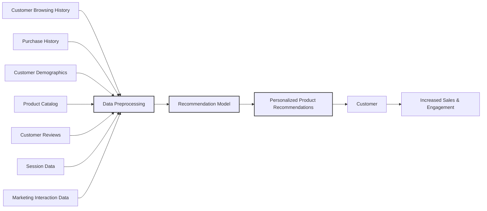
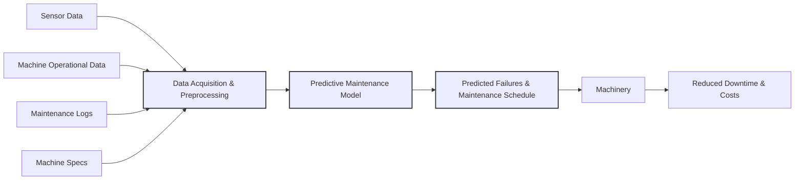
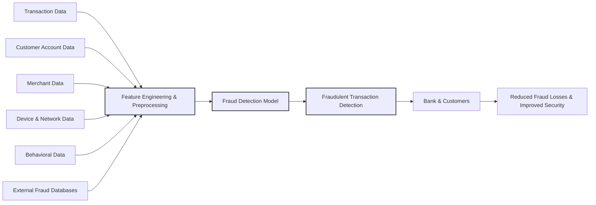
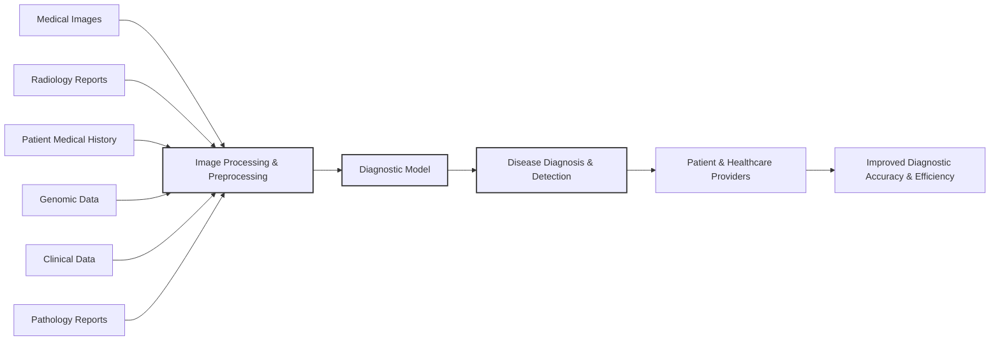
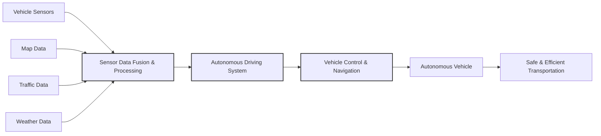
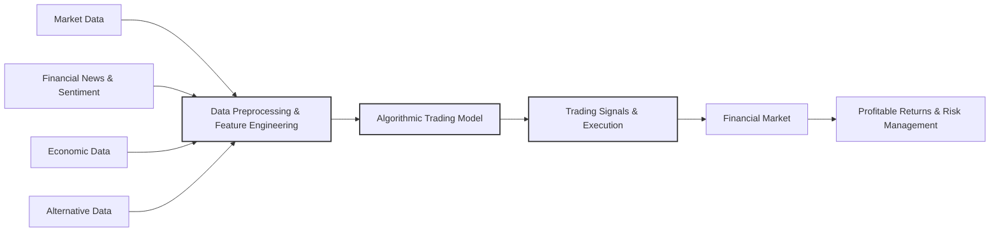

# Assignments

## Assignment 1: AI and ML Use Cases Across Domains

Here's a breakdown for each domain, focusing on Data, Problem Statement, and related points.

---

### 1. Ecommerce

**Use Case:** **Personalized Product Recommendations**



**Data:**

*   **Data Sources:**
    *   **Customer Browsing History:** Website clicks, pages viewed, products searched, time spent on pages.
    *   **Purchase History:** Past orders, items purchased, order frequency, order value.
    *   **Customer Demographics:** Age, gender, location (if available and consented to), potentially interests declared in profiles.
    *   **Product Catalog:** Product descriptions, categories, attributes (color, size, price, brand, etc.), images.
    *   **Customer Reviews and Ratings:** Textual reviews, star ratings for products.
    *   **Session Data:**  User sessions, devices used, time of day browsing.
    *   **Marketing Interaction Data:** Email opens, click-throughs, ad clicks, social media interactions.

*   **Data Issues:**
    *   **Data Sparsity:** Many users might have limited browsing or purchase history, especially new users.
    *   **Data Volume & Velocity:** Ecommerce platforms generate massive amounts of data in real-time.
    *   **Data Privacy:**  Handling customer data responsibly and complying with privacy regulations (GDPR, CCPA etc.).
    *   **Data Quality:** Inconsistent product descriptions, missing attributes, inaccurate customer demographics (if self-reported).
    *   **Cold Start Problem:** Recommending products to new users with no history.
    *   **Dynamic Preferences:** Customer tastes and preferences can change over time.

*   **Types of Data:**
    *   **Structured Data:** Customer demographics, purchase history (transactional data), product catalog (attributes), ratings. (Tables, Databases)
    *   **Unstructured Data:** Customer reviews (text), product images, browsing session data (logs - semi-structured but analyzed as unstructured in many cases).

**Problem Statement:**

*   **Problem:** How to improve customer engagement and increase sales revenue on an e-commerce platform by providing highly relevant and personalized product recommendations to each user in real-time.  Current recommendation methods might be too generic, leading to low click-through rates and missed sales opportunities.

*   **Implications of Solving using AI/ML:**
    *   **Increased Sales:**  More relevant recommendations lead to higher click-through rates, add-to-cart rates, and ultimately, more purchases.
    *   **Improved Customer Experience:** Customers discover products they are genuinely interested in, leading to higher satisfaction and loyalty.
    *   **Enhanced Customer Lifetime Value:** By consistently providing value and relevant recommendations, customers are more likely to return and make repeat purchases.
    *   **Reduced Marketing Costs:** Targeted recommendations can be more efficient than broad marketing campaigns.

*   **Tradeoffs:**
    *   **Complexity & Computational Cost:** Building and deploying sophisticated recommendation models (e.g., deep learning based) can be computationally intensive and require significant infrastructure.
    *   **Interpretability vs. Accuracy:**  Complex models (like deep learning) might provide higher accuracy but are often less interpretable (black box). Simpler models like collaborative filtering are more interpretable but might have lower accuracy.
    *   **Data Privacy vs. Personalization:**  Balancing the need for data to personalize recommendations with user privacy concerns.  Anonymization and differential privacy techniques might be necessary.
    *   **Cold Start Challenge:**  Effectively recommending to new users with limited data requires strategies like content-based filtering or leveraging general popularity trends.

*   **Gains & Metrics:**
    *   **Gains:** Increased conversion rate, higher average order value, improved customer retention rate, better click-through rates on recommendations, increased revenue, improved customer satisfaction (measured through surveys, feedback, repeat purchase rates).
    *   **Metrics:**
        *   **Click-Through Rate (CTR) of Recommendations:** Percentage of users who click on recommended products.
        *   **Conversion Rate:** Percentage of users who make a purchase after interacting with recommendations.
        *   **Average Order Value (AOV):**  Increase in the average value of orders placed by users interacting with recommendations.
        *   **Recommendation Coverage:** Percentage of products in the catalog that are recommended.
        *   **Personalization Metrics:** Metrics measuring the relevance and diversity of recommendations (e.g., precision, recall, NDCG, MAP).
        *   **Customer Satisfaction Score (CSAT) or Net Promoter Score (NPS):** Gauging customer satisfaction and loyalty indirectly influenced by better recommendations.

---

### 2. Manufacturing

**Use Case:** **Predictive Maintenance of Machinery**



**Data:**

*   **Data Sources:**
    *   **Sensor Data from Machines:** Temperature, pressure, vibration, humidity, acoustic signals, oil levels, current, voltage - collected by IoT sensors embedded in equipment.
    *   **Machine Operational Data:**  Runtime, cycles completed, throughput, error codes, alarms, production output.
    *   **Maintenance Logs:**  Records of past maintenance activities, repairs, parts replaced, downtime events, maintenance schedules.
    *   **Environmental Data:** Ambient temperature, humidity in the factory.
    *   **Machine Specifications:**  Age of machine, model, manufacturing date, expected lifespan, original equipment manufacturer (OEM) data.

*   **Data Issues:**
    *   **Data Variety & Volume:** Diverse sensor types generating high-frequency time-series data from numerous machines.
    *   **Data Quality & Noise:** Sensor readings can be noisy, affected by environmental factors or sensor malfunction. Data might be missing due to sensor failures or communication issues.
    *   **Data Synchronization:** Ensuring data from different sensors and machines is properly synchronized and time-stamped.
    *   **Data Silos:** Data might be scattered across different systems (e.g., sensor data in one platform, maintenance logs in another).
    *   **Data Drift:**  Machine operating conditions and sensor behavior can change over time, leading to data drift and requiring model retraining.

*   **Types of Data:**
    *   **Time-Series Data:** Sensor readings (temperature, pressure, vibration etc.) are primarily time-series data.
    *   **Structured Data:** Maintenance logs, machine specifications, operational data (error codes, cycles).
    *   **Unstructured Data:**  Acoustic data (audio signals from machines) can be considered unstructured, needing feature extraction.  Images/video from visual inspection systems (if used) are also unstructured.

**Problem Statement:**

*   **Problem:** Minimize unplanned downtime and reduce maintenance costs in a manufacturing plant by accurately predicting machine failures before they occur, allowing for proactive maintenance scheduling.  Current reactive or schedule-based maintenance approaches lead to costly downtime, inefficient resource allocation, and potential production delays.

*   **Implications of Solving using AI/ML:**
    *   **Reduced Downtime:** Predictive maintenance allows for maintenance to be performed just before a failure is likely to occur, minimizing unexpected stoppages in production.
    *   **Lower Maintenance Costs:** Optimizing maintenance schedules, reducing unnecessary preventative maintenance, and minimizing costly emergency repairs.
    *   **Improved Production Efficiency:** Consistent machine uptime leads to higher production throughput and fewer production delays.
    *   **Extended Machine Lifespan:** Timely maintenance based on actual condition can extend the operational life of equipment.
    *   **Optimized Inventory Management:** Better forecasting of required spare parts for maintenance.

*   **Tradeoffs:**
    *   **Model Complexity & Accuracy:** Achieving high accuracy in predicting failures can require complex models and significant computational resources.  Balancing model complexity with real-time processing needs is important.
    *   **False Positives & False Negatives:**  Predictive maintenance models might generate false alarms (false positives - predicting failure when none occurs) leading to unnecessary maintenance, or miss actual failures (false negatives), resulting in downtime.  Balancing these errors is crucial.
    *   **Data Infrastructure & Integration:** Setting up robust sensor networks, data collection pipelines, and integrating data from various sources can be a significant upfront investment.
    *   **Interpretability of Predictions:**  Understanding *why* a model predicts a failure is important for maintenance engineers to trust and act on the predictions.

*   **Gains & Metrics:**
    *   **Gains:** Reduced downtime (measured in hours/days per year), lower maintenance costs (reduction in parts, labor, emergency repairs), increased machine uptime (percentage), improved production throughput, extended machine lifespan.
    *   **Metrics:**
        *   **Reduction in Downtime:** Measured as the percentage decrease in unplanned downtime compared to previous maintenance strategies.
        *   **Maintenance Cost Savings:**  Percentage reduction in overall maintenance expenditure.
        *   **Prediction Accuracy:**  Precision, Recall, F1-score of the predictive maintenance model in identifying impending failures.
        *   **False Positive Rate (FPR):** Percentage of times the model incorrectly predicts a failure.
        *   **False Negative Rate (FNR):** Percentage of actual failures missed by the model.
        *   **Mean Time Between Failures (MTBF) Improvement:**  Increase in the average time machines operate without failure.
        *   **Return on Investment (ROI) of Predictive Maintenance System:**  Calculating the financial benefits against the cost of implementing the system.

---

### 3. Banking

**Use Case:** **Fraud Detection in Credit Card Transactions**



**Data:**

*   **Data Sources:**
    *   **Transaction Data:** Transaction amount, time, date, location (merchant category, POS location), cardholder information (anonymized IDs), transaction type (online, POS, ATM).
    *   **Customer Account Data:** Account balance, transaction history, demographics (if available), account opening date, account activity patterns.
    *   **Merchant Data:** Merchant category code (MCC), merchant location, past fraud history associated with merchants.
    *   **Device & Network Data:** IP address, device type, browser information, geolocation of transaction (if available).
    *   **Behavioral Data:**  Spending patterns, typical transaction locations, time of transactions, deviation from usual behavior.
    *   **External Fraud Databases:** Blacklists of fraudulent cards, compromised accounts, reported fraud incidents.

*   **Data Issues:**
    *   **Imbalanced Data:** Fraudulent transactions are typically a very small percentage of total transactions, leading to highly imbalanced datasets.
    *   **Data Drift & Concept Drift:** Fraud patterns evolve constantly as fraudsters adapt to detection methods. Models need to adapt to these changing patterns.
    *   **Data Privacy & Security:** Sensitive financial data requires stringent security measures and compliance with regulations (PCI DSS, GDPR).
    *   **Real-time Processing Requirements:** Fraud detection needs to happen in real-time or near real-time to prevent fraudulent transactions from being authorized.
    *   **Feature Engineering Challenges:** Identifying relevant features that effectively distinguish between fraudulent and legitimate transactions is crucial.
    *   **Data Sparsity (for certain features):**  Device and network data might not be consistently available for all transactions.

*   **Types of Data:**
    *   **Structured Data:** Transaction data, customer account data, merchant data, external fraud databases.
    *   **Behavioral Data:**  Often derived from transaction history and account activity, can be structured or represented as features.
    *   **Network Data:** IP addresses, device information - can be structured or semi-structured depending on how it is represented.

**Problem Statement:**

*   **Problem:** Minimize financial losses due to credit card fraud while maintaining a smooth customer experience and avoiding excessive false alarms (legitimate transactions being flagged as fraudulent). Current rule-based fraud detection systems are often insufficient in catching sophisticated fraud and can lead to high false positive rates, inconveniencing legitimate customers.

*   **Implications of Solving using AI/ML:**
    *   **Reduced Financial Losses:**  Detecting and preventing fraudulent transactions directly reduces financial losses for banks and customers.
    *   **Improved Customer Trust & Security:**  Protecting customers from fraud enhances trust in the bank and its services.
    *   **Enhanced Customer Experience:**  Minimizing false positives ensures legitimate transactions are processed smoothly, avoiding customer frustration.
    *   **Compliance with Regulations:**  Meeting regulatory requirements related to fraud prevention and data security.
    *   **Operational Efficiency:**  Automated fraud detection systems can reduce the need for manual review of suspicious transactions.

*   **Tradeoffs:**
    *   **Precision vs. Recall:**  Fraud detection often involves a tradeoff between precision (minimizing false positives) and recall (maximizing detection of actual fraud).  High precision is needed to avoid inconveniencing customers, while high recall is important to minimize financial losses.  The optimal balance depends on the bank's risk tolerance.
    *   **Model Complexity & Real-time Performance:**  Complex models might be more accurate but can be slower, potentially impacting real-time transaction authorization speed. Simpler, faster models might be needed for real-time processing.
    *   **Interpretability vs. Accuracy:**  Regulations might require interpretable models to understand why a transaction is flagged as fraudulent.  Complex "black box" models might be harder to explain and audit.
    *   **Cost of Implementation & Maintenance:**  Building and maintaining sophisticated fraud detection systems requires investment in infrastructure, data processing, and model development.

*   **Gains & Metrics:**
    *   **Gains:** Reduction in fraud losses (dollars saved), lower false positive rate, improved customer satisfaction (reduction in complaints about blocked legitimate transactions), enhanced security reputation, operational efficiency gains.
    *   **Metrics:**
        *   **Fraud Detection Rate (Recall):** Percentage of actual fraudulent transactions detected.
        *   **False Positive Rate (FPR):** Percentage of legitimate transactions incorrectly flagged as fraudulent.
        *   **Precision:**  Out of all transactions flagged as fraudulent, what percentage is actually fraudulent.
        *   **Area Under the ROC Curve (AUC):**  Overall performance measure balancing recall and FPR across different thresholds.
        *   **Cost of Fraud Losses Reduced:**  Monetary value of fraud losses prevented by the system.
        *   **Customer Complaint Rate related to Fraud Detection:**  Tracking customer complaints about incorrectly blocked transactions.
        *   **Transaction Processing Time:** Ensuring fraud detection doesn't significantly delay transaction authorization.

---

### 4. Healthcare

**Use Case:** **Medical Image Analysis for Disease Diagnosis (e.g., Cancer Detection from X-rays, CT scans, MRIs)**



**Data:**

*   **Data Sources:**
    *   **Medical Images:** X-rays, CT scans, MRIs, mammograms, retinal scans - images in various formats (DICOM, JPEG, PNG).
    *   **Radiology Reports:** Textual reports written by radiologists describing findings in medical images.
    *   **Patient Medical History:** Electronic Health Records (EHRs) containing demographics, medical history, symptoms, diagnoses, lab results, treatment history.
    *   **Genomic Data:** Genetic information of patients (relevant for some diseases like cancer).
    *   **Clinical Data:** Patient vitals, symptoms, physical examination findings.
    *   **Pathology Reports:**  Histopathology images of tissue samples and corresponding reports.

*   **Data Issues:**
    *   **Data Privacy & Security (HIPAA Compliance in the US, GDPR elsewhere):**  Extremely sensitive patient data requiring strict privacy and security measures. Anonymization, de-identification techniques are crucial.
    *   **Data Volume & Variety of Medical Images:**  Large volumes of high-resolution images in different modalities (X-ray, CT, MRI) and formats.
    *   **Data Annotation & Labeling:**  Requires expert radiologists or clinicians to manually annotate images (e.g., outlining tumors, identifying abnormalities) to create ground truth labels for supervised learning. Annotation can be time-consuming, expensive, and subject to inter-observer variability.
    *   **Data Imbalance:**  Disease cases might be rare compared to normal cases, leading to imbalanced datasets.
    *   **Data Heterogeneity:** Images can vary significantly due to different scanners, protocols, patient positioning, and disease manifestations.
    *   **Interpretability & Explainability in Medical Domain:**  "Black box" AI models are often less acceptable in healthcare. Clinicians need to understand *why* a model made a particular diagnosis to trust and use it.

*   **Types of Data:**
    *   **Image Data:** Medical images (X-rays, CT, MRI) are the primary data type.
    *   **Text Data:** Radiology reports, pathology reports, EHR text notes.
    *   **Structured Data:** Patient demographics, lab results, structured elements from EHRs.
    *   **Genomic Data:**  DNA sequences, gene expression data.

**Problem Statement:**

*   **Problem:** Improve the accuracy and efficiency of disease diagnosis from medical images, reduce diagnostic errors, and potentially assist radiologists in their workflow, especially in high-volume settings or for subtle findings that might be missed by the human eye.  Current manual image interpretation by radiologists can be time-consuming, subject to human fatigue and variability, and can lead to diagnostic delays or errors.

*   **Implications of Solving using AI/ML:**
    *   **Improved Diagnostic Accuracy:**  AI/ML models can potentially achieve accuracy comparable to or even exceeding human radiologists in certain diagnostic tasks, especially for large datasets and subtle patterns.
    *   **Faster Diagnosis:**  Automated image analysis can significantly reduce the time required for diagnosis, leading to quicker treatment initiation.
    *   **Increased Efficiency for Radiologists:** AI tools can act as "second readers," flagging suspicious regions for radiologists to focus on, reducing workload and improving efficiency.
    *   **Reduced Diagnostic Errors & Variability:** AI can potentially reduce human error and inter-observer variability in image interpretation.
    *   **Earlier Disease Detection:**  Potentially detect diseases at earlier, more treatable stages.
    *   **Improved Access to Expertise:**  AI tools can potentially extend the reach of specialist expertise to areas with limited access to radiologists.

*   **Tradeoffs:**
    *   **Model Accuracy & Generalization:**  Models trained on one dataset might not generalize well to images from different scanners or patient populations. Robustness and generalization are crucial.
    *   **Explainability & Trust:**  Explainability of AI decisions is paramount in healthcare.  Clinicians need to understand the basis of AI diagnoses to trust and integrate them into clinical practice. Techniques like attention mechanisms, saliency maps, and rule extraction are important.
    *   **Regulatory Approval & Validation:**  Medical AI systems require rigorous validation, clinical trials, and regulatory approvals (FDA in the US, CE marking in Europe) before they can be used in clinical practice.
    *   **Data Bias:**  Training datasets might be biased (e.g., underrepresentation of certain demographics or disease subtypes), leading to biased model performance. Careful dataset curation and bias mitigation are needed.
    *   **Integration into Clinical Workflow:**  Seamless integration of AI tools into existing radiology workflows is critical for adoption.

*   **Gains & Metrics:**
    *   **Gains:** Increased diagnostic accuracy (sensitivity, specificity), reduced diagnostic turnaround time, improved radiologist efficiency, reduced diagnostic errors, earlier disease detection, improved patient outcomes.
    *   **Metrics:**
        *   **Sensitivity:**  Proportion of actual disease cases correctly identified by the AI system.
        *   **Specificity:** Proportion of healthy cases correctly identified as healthy by the AI system.
        *   **Accuracy:** Overall correctness of diagnoses.
        *   **Area Under the ROC Curve (AUC):**  Performance measure balancing sensitivity and specificity.
        *   **Reduction in False Negative Rate:**  Minimizing missed disease cases.
        *   **Reduction in False Positive Rate:**  Minimizing incorrect diagnoses of disease.
        *   **Time to Diagnosis:**  Reduction in time taken to reach a diagnosis compared to traditional methods.
        *   **Radiologist Workflow Efficiency Improvement:** Measured by reduced reporting time, improved throughput, or reduced workload.
        *   **Clinical Outcomes (in longer term studies):**  Impact on patient survival rates, treatment outcomes, and overall healthcare costs.

---

### 5. Transport

**Use Case:** **Autonomous Driving (Self-Driving Vehicles)**



**Data:**

*   **Data Sources:**
    *   **Sensor Data from Vehicle:**
        *   **Cameras:** RGB images, depth maps (from stereo cameras or depth sensors) – capturing visual information about surroundings (lanes, traffic lights, pedestrians, other vehicles).
        *   **LiDAR (Light Detection and Ranging):** Point cloud data – creating 3D maps of the environment, detecting objects and their distances.
        *   **Radar (Radio Detection and Ranging):** Range and velocity of objects – works in various weather conditions.
        *   **Ultrasonic Sensors:** Short-range proximity detection – used for parking assistance and close-range obstacle detection.
        *   **Inertial Measurement Unit (IMU):** Acceleration, angular velocity – for vehicle motion tracking and localization.
        *   **GPS/GNSS:** Global positioning data – for localization and navigation.
        *   **Wheel Speed Sensors, Steering Angle Sensors, Throttle/Brake Input:** Vehicle state data.
    *   **Map Data:** High-definition (HD) maps with detailed road information, lane markings, traffic signs, points of interest (POIs).
    *   **Traffic Data:** Real-time traffic flow, congestion information (from traffic sensors, navigation apps, other vehicles).
    *   **Weather Data:** Current and forecasted weather conditions (visibility, rain, snow, fog).
    *   **Vehicle Telemetry Data:**  Vehicle speed, engine status, diagnostic codes (useful for maintenance and performance monitoring of autonomous fleets).

*   **Data Issues:**
    *   **Data Volume & Velocity:** Autonomous vehicles generate massive amounts of sensor data in real-time (multiple cameras, LiDAR, radar etc. operating at high frequencies).
    *   **Data Quality & Noise:** Sensor data can be noisy, affected by weather conditions (rain, fog, snow), lighting conditions (night, glare), sensor limitations, and occlusions.
    *   **Real-time Processing Requirements:**  Autonomous driving decisions must be made in real-time based on sensor input. Low latency data processing and fast model inference are crucial.
    *   **Data Fusion & Sensor Redundancy:**  Integrating data from multiple sensor types (camera, LiDAR, radar) to create a robust and reliable perception of the environment. Handling sensor failures and ensuring redundancy are important for safety.
    *   **Edge Cases & Rare Events:**  Training data needs to cover a wide range of driving scenarios, including rare and challenging situations (unusual road conditions, unexpected pedestrian behavior, emergency situations).  Collecting sufficient data for these edge cases can be difficult.
    *   **Data Bias & Fairness:**  Ensuring training data represents diverse driving environments, weather conditions, and pedestrian/cyclist behaviors across different demographics to avoid biased autonomous driving behavior.
    *   **Safety-Critical Nature & Reliability:**  Autonomous driving systems are safety-critical, requiring extremely high levels of reliability and robustness. Failures can have severe consequences.

*   **Types of Data:**
    *   **Image Data:** Camera images.
    *   **Point Cloud Data:** LiDAR data.
    *   **Time-Series Data:** Sensor readings (radar, ultrasonic, IMU, vehicle state).
    *   **Map Data:**  Structured data (road network, lane information) and potentially raster/image data (map tiles).
    *   **Structured Data:** Traffic data, weather data, vehicle telemetry.

**Problem Statement:**

*   **Problem:** Develop a safe and reliable autonomous driving system capable of navigating complex real-world environments, handling diverse driving scenarios, and ensuring passenger and pedestrian safety.  Current human-driven transport systems are prone to human error, traffic congestion, and accidents. Achieving full autonomy requires overcoming significant technical challenges in perception, planning, and control.

*   **Implications of Solving using AI/ML:**
    *   **Reduced Traffic Accidents:**  Autonomous vehicles have the potential to significantly reduce traffic accidents caused by human error (distraction, fatigue, impaired driving).
    *   **Improved Traffic Flow & Reduced Congestion:**  Optimized driving behavior of autonomous vehicles could lead to smoother traffic flow and reduced congestion.
    *   **Increased Transportation Efficiency:**  Autonomous vehicles can potentially operate more efficiently, optimizing routes, speeds, and fuel consumption.
    *   **Enhanced Accessibility & Mobility:**  Autonomous vehicles could improve mobility for elderly, disabled, and those who cannot drive themselves.
    *   **New Business Models & Services:**  Autonomous vehicles can enable new transportation services like robotaxis, autonomous delivery, and shared mobility.

*   **Tradeoffs:**
    *   **Safety vs. Performance:**  Balancing safety with driving performance (smoothness, speed, efficiency).  Overly cautious autonomous driving might be safe but inefficient and frustrating.
    *   **Generalization & Robustness vs. Specialization:**  Creating a system that generalizes to diverse driving environments and conditions is challenging.  Specializing for specific environments might be easier but less versatile.
    *   **Computational Complexity & Real-time Latency:**  Complex AI models for perception, planning, and control need to operate in real-time with low latency, requiring powerful onboard computing platforms.
    *   **Ethical Dilemmas & Decision-Making:**  Autonomous vehicles will face ethical dilemmas in accident scenarios (e.g., the "trolley problem").  Programming ethical decision-making into AI systems is a complex challenge.
    *   **Job Displacement:**  Widespread adoption of autonomous driving could lead to job displacement for professional drivers (truck drivers, taxi drivers, etc.).
    *   **Public Acceptance & Trust:**  Building public trust in the safety and reliability of autonomous driving technology is crucial for widespread adoption.
    *   **Regulatory & Legal Framework:**  Developing appropriate regulations and legal frameworks to govern autonomous vehicle operation, liability, and safety is necessary.

*   **Gains & Metrics:**
    *   **Gains:** Reduction in traffic accidents (fatalities, injuries, property damage), improved traffic flow (reduced congestion, travel time), increased transportation efficiency (fuel savings, reduced emissions), enhanced mobility for underserved populations.
    *   **Metrics:**
        *   **Accident Rate (per mile/km driven):**  Comparing accident rates of autonomous vehicles to human-driven vehicles in similar conditions.
        *   **Disengagement Rate:**  Frequency of human driver intervention needed to take over control from the autonomous system (a lower rate indicates better autonomy).
        *   **Miles Driven in Autonomous Mode:**  Total miles driven without human intervention.
        *   **Success Rate in Navigation Tasks:**  Percentage of navigation tasks (e.g., reaching destination) successfully completed autonomously.
        *   **Traffic Efficiency Metrics:**  Average speed, traffic flow, congestion levels in areas with autonomous vehicle deployment.
        *   **Safety Validation Metrics:**  Results of rigorous safety testing and simulations in diverse scenarios.
        *   **Public Perception Surveys:**  Measuring public trust and acceptance of autonomous driving technology.

---

### 6. Finance

**Use Case:** **Algorithmic Trading**



**Data:**

*   **Data Sources:**
    *   **Market Data (Real-time & Historical):**
        *   **Stock Prices, Indices:** Open, High, Low, Close prices, volume, trading volume, bid/ask prices for stocks, ETFs, indices, futures, options.
        *   **Financial News & Sentiment:** News articles, financial reports, social media sentiment, analyst ratings, economic news releases.
        *   **Order Book Data:** Limit orders, market orders, order depth, liquidity information.
        *   **Technical Indicators:** Calculated indicators like Moving Averages, RSI, MACD, Bollinger Bands, derived from price and volume data.
    *   **Economic Data:**
        *   **Macroeconomic Indicators:** GDP growth, inflation rates, interest rates, unemployment rates, consumer confidence, PMI, industrial production.
        *   **Company Financial Data:**  Balance sheets, income statements, cash flow statements, earnings reports, analyst forecasts.
    *   **Alternative Data:**
        *   **Satellite Imagery:**  Monitoring parking lot activity at retail stores to predict sales.
        *   **Credit Card Transaction Data (Aggregated, Anonymized):**  Consumer spending trends.
        *   **Web Scraping Data:**  Product prices, online reviews, job postings, social media trends.
        *   **Geopolitical Events:**  Political news, international relations, policy changes.

*   **Data Issues:**
    *   **Data Volume & Velocity:** High-frequency trading generates massive amounts of market data in milliseconds.
    *   **Data Noise & Volatility:** Financial markets are inherently noisy and volatile.  Market data is susceptible to fluctuations, outliers, and unexpected events.
    *   **Data Quality & Accuracy:** Data feeds might contain errors, inconsistencies, or delays. Data from different sources might need to be cleaned and reconciled.
    *   **Data Lookahead Bias:**  Using future data to train models for predicting past events can lead to unrealistic performance and overfitting.  Time-series validation techniques are crucial.
    *   **Market Microstructure Noise:**  High-frequency data can be affected by microstructure noise (bid-ask bounce, order book dynamics) which can obscure true market signals.
    *   **Feature Engineering Complexity:**  Identifying predictive features from vast datasets requires domain expertise and sophisticated feature engineering techniques.  Relevant features might be non-linear and time-varying.
    *   **Regime Shifts & Market Dynamics:**  Financial markets are dynamic and can undergo regime shifts (changes in market behavior, correlations, volatility). Models need to adapt to these changes and be robust to regime shifts.

*   **Types of Data:**
    *   **Time-Series Data:** Stock prices, indices, market data, economic indicators.
    *   **Text Data:** Financial news, reports, sentiment analysis.
    *   **Structured Data:** Company financials, economic data, order book data (can be structured or semi-structured).
    *   **Alternative Data:**  Various types depending on source (image, text, structured).

**Problem Statement:**

*   **Problem:** Develop algorithmic trading strategies that can consistently generate profitable returns in financial markets while managing risk effectively and adapting to changing market conditions.  Human traders are limited by speed, cognitive biases, and emotional factors. Algorithmic trading aims to automate trading decisions and potentially outperform human traders by leveraging data and computational power.

*   **Implications of Solving using AI/ML:**
    *   **Improved Trading Performance:**  Potentially achieve higher returns, better risk-adjusted returns (Sharpe ratio, Sortino ratio), and consistent profitability compared to traditional trading methods.
    *   **Increased Trading Efficiency & Speed:**  Algorithms can execute trades much faster than human traders, capturing fleeting market opportunities and reducing execution costs.
    *   **Reduced Emotional Bias:**  Algorithms can make objective trading decisions based on data and rules, eliminating emotional biases that can negatively impact human traders.
    *   **Enhanced Risk Management:**  Algorithms can implement sophisticated risk management strategies and automatically adjust trading positions based on market volatility and risk parameters.
    *   **24/7 Market Monitoring & Trading:**  Algorithms can continuously monitor markets and execute trades around the clock, capturing opportunities across different time zones.
    *   **Automation of Trading Strategies:**  Automating complex trading strategies and reducing the need for manual intervention.

*   **Tradeoffs:**
    *   **Overfitting & Generalization:**  Algorithmic trading models can be prone to overfitting to historical data, leading to poor performance in live trading.  Robust validation techniques and regularization are crucial.
    *   **Black Swan Events & Unpredictability:**  Financial markets are subject to unpredictable "black swan" events (rare, high-impact events) that can cause algorithmic trading strategies to fail.  Robust risk management and contingency plans are necessary.
    *   **Market Impact & Feedback Loops:**  Large-scale algorithmic trading can influence market prices and create feedback loops.  Algorithms need to be designed to minimize market impact and avoid destabilizing the market.
    *   **Regulatory Scrutiny & Compliance:**  Algorithmic trading is subject to increasing regulatory scrutiny to ensure market fairness, transparency, and stability.  Compliance with regulations is essential.
    *   **Infrastructure & Technology Costs:**  Developing and deploying sophisticated algorithmic trading systems requires investment in high-performance computing infrastructure, data feeds, and software development.
    *   **Interpretability & Explainability (for regulatory and risk management):**  Understanding the logic and decision-making process of complex trading algorithms is important for risk management and regulatory compliance.

*   **Gains & Metrics:**
    *   **Gains:** Increased profitability, higher risk-adjusted returns, reduced transaction costs, improved trading efficiency, enhanced risk management capabilities, automation of trading processes.
    *   **Metrics:**
        *   **Annualized Return:**  Percentage return on investment over a year.
        *   **Sharpe Ratio:**  Risk-adjusted return measure (higher Sharpe ratio indicates better risk-adjusted performance).
        *   **Sortino Ratio:**  Risk-adjusted return measure focused on downside risk.
        *   **Maximum Drawdown:**  Maximum peak-to-trough decline in portfolio value – measures downside risk.
        *   **Transaction Costs:**  Costs associated with executing trades (commissions, slippage).
        *   **Execution Speed & Latency:**  Time taken to execute trades.
        *   **Win Rate & Profit Factor:**  Performance metrics of individual trades or trading signals.
        *   **Alpha (vs. Benchmark):**  Outperformance of the algorithmic strategy compared to a benchmark market index.
        *   **Regulatory Compliance Metrics:**  Measures of adherence to trading regulations and risk limits.

---

## Assignment 2: Use Methods of Python Datatypes (Objects)

### Int

**__abs__(self, /)**

* Returns the absolute value of the integer.
```python
number = -10
absolute_number = abs(number)
print(absolute_number)
```
output:
```
10
```

**__add__(self, value, /)**

* Returns the sum of the integer and another value.
```python
num1 = 5
num2 = 3
sum_result = num1 + num2
print(sum_result)
```
output:
```
8
```

**__and__(self, value, /)**

* Returns the bitwise AND of the integer and another value.
```python
num1 = 10  # Binary: 1010
num2 = 6   # Binary: 0110
and_result = num1 & num2
print(and_result)
```
output:
```
2
```

**__bool__(self, /)**

* Returns True if the integer is non-zero, False if zero.
```python
num1 = 5
num2 = 0
bool_result1 = bool(num1)
bool_result2 = bool(num2)
print(bool_result1)
print(bool_result2)
```
output:
```
True
False
```

**__ceil__(...)**

* Returns the ceiling of the integer, which is the integer itself.
```python
num = 7
ceil_result = num.__ceil__()
print(ceil_result)
```
output:
```
7
```

**__divmod__(self, value, /)**

* Returns a pair of numbers (quotient and remainder) when the integer is divided by another value.
```python
num1 = 17
num2 = 5
divmod_result = divmod(num1, num2)
print(divmod_result)
```
output:
```
(3, 2)
```

**__eq__(self, value, /)**

* Returns True if the integer is equal to another value, False otherwise.
```python
num1 = 10
num2 = 10
num3 = 15
eq_result1 = (num1 == num2)
eq_result2 = (num1 == num3)
print(eq_result1)
print(eq_result2)
```
output:
```
True
False
```

**__float__(self, /)**

* Returns the integer as a floating-point number.
```python
num = 25
float_num = float(num)
print(float_num)
```
output:
```
25.0
```

**__floor__(...)**

* Returns the floor of the integer, which is the integer itself.
```python
num = 9
floor_result = num.__floor__()
print(floor_result)
```
output:
```
9
```

**__floordiv__(self, value, /)**

* Returns the floor division of the integer by another value.
```python
num1 = 20
num2 = 6
floordiv_result = num1 // num2
print(floordiv_result)
```
output:
```
3
```

**__format__(self, format_spec, /)**

* Returns a formatted string representation of the integer.
```python
num = 12345
formatted_num = format(num, ',') # Using comma as thousands separator
print(formatted_num)
```
output:
```
12,345
```

**__ge__(self, value, /)**

* Returns True if the integer is greater than or equal to another value, False otherwise.
```python
num1 = 10
num2 = 10
num3 = 5
ge_result1 = (num1 >= num2)
ge_result2 = (num1 >= num3)
print(ge_result1)
print(ge_result2)
```
output:
```
True
True
```

**__getattribute__(self, name, /)**

* Returns the attribute of the integer.
```python
num = 42
attribute_name = '__add__'
add_method = num.__getattribute__(attribute_name)
print(add_method)
```
output:
```
<method-wrapper '__add__' of int object at 0x...>
```

**__getnewargs__(self, /)**

* Returns the arguments needed to create a new instance of the integer.
```python
num = 7
new_args = num.__getnewargs__()
print(new_args)
```
output:
```
(7,)
```

**__gt__(self, value, /)**

* Returns True if the integer is greater than another value, False otherwise.
```python
num1 = 10
num2 = 5
num3 = 10
gt_result1 = (num1 > num2)
gt_result2 = (num1 > num3)
print(gt_result1)
print(gt_result2)
```
output:
```
True
False
```

**__hash__(self, /)**

* Returns the hash value of the integer.
```python
num = 123
hash_value = hash(num)
print(hash_value)
```
output:
```
123
```

**__index__(self, /)**

* Returns the integer itself, allowing it to be used as an index.
```python
my_list = ['a', 'b', 'c', 'd']
index = 2
element = my_list[index]
print(element)
```
output:
```
c
```

**__int__(self, /)**

* Returns the integer value itself.
```python
num_str = "42"
int_num = int(num_str)
print(int_num)
```
output:
```
42
```

**__invert__(self, /)**

* Returns the bitwise NOT of the integer.
```python
num = 5  # Binary: 0101
invert_result = ~num
print(invert_result)
```
output:
```
-6
```

**__le__(self, value, /)**

* Returns True if the integer is less than or equal to another value, False otherwise.
```python
num1 = 5
num2 = 10
num3 = 5
le_result1 = (num1 <= num2)
le_result2 = (num1 <= num3)
print(le_result1)
print(le_result2)
```
output:
```
True
True
```

**__lshift__(self, value, /)**

* Returns the bitwise left shift of the integer by another value.
```python
num = 5  # Binary: 0101
shift_value = 2
lshift_result = num << shift_value
print(lshift_result)
```
output:
```
20
```

**__lt__(self, value, /)**

* Returns True if the integer is less than another value, False otherwise.
```python
num1 = 5
num2 = 10
num3 = 5
lt_result1 = (num1 < num2)
lt_result2 = (num1 < num3)
print(lt_result1)
print(lt_result2)
```
output:
```
True
False
```

**__mod__(self, value, /)**

* Returns the modulo (remainder) of the integer when divided by another value.
```python
num1 = 22
num2 = 5
mod_result = num1 % num2
print(mod_result)
```
output:
```
2
```

**__mul__(self, value, /)**

* Returns the product of the integer and another value.
```python
num1 = 7
num2 = 6
mul_result = num1 * num2
print(mul_result)
```
output:
```
42
```

**__ne__(self, value, /)**

* Returns True if the integer is not equal to another value, False otherwise.
```python
num1 = 10
num2 = 5
num3 = 10
ne_result1 = (num1 != num2)
ne_result2 = (num1 != num3)
print(ne_result1)
print(ne_result2)
```
output:
```
True
False
```

**__neg__(self, /)**

* Returns the negation of the integer.
```python
num = 15
neg_result = -num
print(neg_result)
```
output:
```
-15
```

**__or__(self, value, /)**

* Returns the bitwise OR of the integer and another value.
```python
num1 = 10  # Binary: 1010
num2 = 6   # Binary: 0110
or_result = num1 | num2
print(or_result)
```
output:
```
14
```

**__pos__(self, /)**

* Returns the integer itself (unary plus operator).
```python
num = -8
pos_result = +num
print(pos_result)
```
output:
```
-8
```

**__pow__(self, value, mod=None, /)**

* Returns the integer raised to the power of another value, optionally modulo a third value.
```python
num = 2
power_result = pow(num, 3)
print(power_result)
```
output:
```
8
```

**__radd__(self, value, /)**

* Returns the sum of another value and the integer (reversed operands for addition).
```python
num = 8
radd_result = 2 + num
print(radd_result)
```
output:
```
10
```

**__rand__(self, value, /)**

* Returns the bitwise AND of another value and the integer (reversed operands for bitwise AND).
```python
num = 7 # Binary 0111
rand_result = 3 & num
print(rand_result)
```
output:
```
3
```

**__rdivmod__(self, value, /)**

* Returns a pair of numbers (quotient and remainder) when another value is divided by the integer (reversed operands for divmod).
```python
num = 3
rdivmod_result = divmod(17, num)
print(rdivmod_result)
```
output:
```
(5, 2)
```

**__repr__(self, /)**

* Returns a string representation of the integer.
```python
num = 123
repr_result = repr(num)
print(repr_result)
```
output:
```
123
```

**__rfloordiv__(self, value, /)**

* Returns the floor division of another value by the integer (reversed operands for floor division).
```python
num = 4
rfloordiv_result = 25 // num
print(rfloordiv_result)
```
output:
```
6
```

**__rlshift__(self, value, /)**

* Returns the bitwise left shift of another value by the integer (reversed operands for left shift).
```python
num = 2
rlshift_result = 5 << num
print(rlshift_result)
```
output:
```
20
```

**__rmod__(self, value, /)**

* Returns the modulo (remainder) of another value when divided by the integer (reversed operands for modulo).
```python
num = 7
rmod_result = 23 % num
print(rmod_result)
```
output:
```
2
```

**__rmul__(self, value, /)**

* Returns the product of another value and the integer (reversed operands for multiplication).
```python
num = 9
rmul_result = 4 * num
print(rmul_result)
```
output:
```
36
```

**__ror__(self, value, /)**

* Returns the bitwise OR of another value and the integer (reversed operands for bitwise OR).
```python
num = 3 # Binary 0011
ror_result = 10 | num
print(ror_result)
```
output:
```
11
```

**__round__(...)**

* Returns the integer rounded to the nearest integer (which is itself).
```python
num = 12
round_result = round(num)
print(round_result)
```
output:
```
12
```

**__rpow__(self, value, mod=None, /)**

* Returns another value raised to the power of the integer (reversed operands for power).
```python
num = 2
rpow_result = 3 ** num
print(rpow_result)
```
output:
```
9
```

**__rrshift__(self, value, /)**

* Returns the bitwise right shift of another value by the integer (reversed operands for right shift).
```python
num = 2
rrshift_result = 20 >> num
print(rrshift_result)
```
output:
```
5
```

**__rshift__(self, value, /)**

* Returns the bitwise right shift of the integer by another value.
```python
num = 20  # Binary: 10100
shift_value = 2
rshift_result = num >> shift_value
print(rshift_result)
```
output:
```
5
```

**__rsub__(self, value, /)**

* Returns the difference of another value and the integer (reversed operands for subtraction).
```python
num = 4
rsub_result = 15 - num
print(rsub_result)
```
output:
```
11
```

**__rtruediv__(self, value, /)**

* Returns the true division of another value by the integer (reversed operands for true division).
```python
num = 4
rtruediv_result = 20 / num
print(rtruediv_result)
```
output:
```
5.0
```

**__rxor__(self, value, /)**

* Returns the bitwise XOR of another value and the integer (reversed operands for bitwise XOR).
```python
num = 12 # Binary 1100
rxor_result = 7 ^ num
print(rxor_result)
```
output:
```
11
```

**__sizeof__(self, /)**

* Returns the size of the integer object in memory, in bytes.
```python
num = 1000
size_bytes = num.__sizeof__()
print(size_bytes)
```
output:
```
28
```

**__sub__(self, value, /)**

* Returns the difference of the integer and another value.
```python
num1 = 30
num2 = 7
sub_result = num1 - num2
print(sub_result)
```
output:
```
23
```

**__truediv__(self, value, /)**

* Returns the true division of the integer by another value (always results in a float).
```python
num1 = 25
num2 = 4
truediv_result = num1 / num2
print(truediv_result)
```
output:
```
6.25
```

**__trunc__(...)**

* Returns the integer truncated towards zero, which is the integer itself.
```python
num = 15
trunc_result = num.__trunc__()
print(trunc_result)
```
output:
```
15
```

**__xor__(self, value, /)**

* Returns the bitwise XOR of the integer and another value.
```python
num1 = 12  # Binary: 1100
num2 = 7   # Binary: 0111
xor_result = num1 ^ num2
print(xor_result)
```
output:
```
11
```

**as_integer_ratio(self, /)**

* Returns a pair of integers (numerator and denominator) representing the exact ratio of the integer.
```python
num = 10
ratio = num.as_integer_ratio()
print(ratio)
```
output:
```
(10, 1)
```

**bit_count(self, /)**

* Returns the number of set bits (1s) in the binary representation of the absolute value of the integer.
```python
num = 13 # Binary: 1101
bit_count_result = num.bit_count()
print(bit_count_result)
```
output:
```
3
```

**bit_length(self, /)**

* Returns the number of bits needed to represent the integer in binary.
```python
num = 37 # Binary: 100101
bit_length_result = num.bit_length()
print(bit_length_result)
```
output:
```
6
```

**conjugate(...)**

* Returns the complex conjugate of the integer, which is the integer itself.
```python
num = 42
conjugate_result = num.conjugate()
print(conjugate_result)
```
output:
```
42
```

**to_bytes(self, /, length=1, byteorder='big', *, signed=False)**

* Returns a byte array representing the integer.
```python
num = 255
bytes_big_endian = num.to_bytes(length=1, byteorder='big')
print(bytes_big_endian)
```
output:
```
b'\xff'
```

**from_bytes(bytes, byteorder='big', *, signed=False) (Class method)**

* (Class method) Returns an integer from a byte array.
```python
byte_data_big = b'\x0a' # 10 in big-endian byte
int_from_bytes_big = int.from_bytes(byte_data_big, byteorder='big')
print(int_from_bytes_big)
```
output:
```
10
```

### Float

**__abs__(self, /)**

* Returns the absolute value of the float.
```python
number = -3.14
absolute_number = abs(number)
print(absolute_number)
```
output:
```
3.14
```

**__add__(self, value, /)**

* Returns the sum of the float and another value.
```python
num1 = 2.5
num2 = 1.5
sum_result = num1 + num2
print(sum_result)
```
output:
```
4.0
```

**__bool__(self, /)**

* Returns True if the float is non-zero, False if zero.
```python
num1 = 0.5
num2 = 0.0
bool_result1 = bool(num1)
bool_result2 = bool(num2)
print(bool_result1)
print(bool_result2)
```
output:
```
True
False
```

**__ceil__(...)**

* Returns the ceiling of the float, the smallest integer greater than or equal to the float.
```python
num = 3.14
ceil_result = num.__ceil__()
print(ceil_result)
```
output:
```
4
```

**__divmod__(self, value, /)**

* Returns a pair of numbers (quotient and remainder) when the float is divided by another value.
```python
num1 = 17.5
num2 = 5
divmod_result = divmod(num1, num2)
print(divmod_result)
```
output:
```
(3.0, 2.5)
```

**__eq__(self, value, /)**

* Returns True if the float is equal to another value, False otherwise.
```python
num1 = 3.0
num2 = 3.0
num3 = 3.1
eq_result1 = (num1 == num2)
eq_result2 = (num1 == num3)
print(eq_result1)
print(eq_result2)
```
output:
```
True
False
```

**__float__(self, /)**

* Returns the float value itself.
```python
num = 7.8
float_num = float(num)
print(float_num)
```
output:
```
7.8
```

**__floor__(...)**

* Returns the floor of the float, the largest integer less than or equal to the float.
```python
num = 3.7
floor_result = num.__floor__()
print(floor_result)
```
output:
```
3
```

**__floordiv__(self, value, /)**

* Returns the floor division of the float by another value.
```python
num1 = 20.0
num2 = 6
floordiv_result = num1 // num2
print(floordiv_result)
```
output:
```
3.0
```

**__format__(self, format_spec, /)**

* Returns a formatted string representation of the float.
```python
num = 1234.567
formatted_num = format(num, '.2f') # Format to 2 decimal places
print(formatted_num)
formatted_scientific = format(num, 'e') # Scientific notation
print(formatted_scientific)
```
output:
```
1234.57
1.234567e+03
```

**__ge__(self, value, /)**

* Returns True if the float is greater than or equal to another value, False otherwise.
```python
num1 = 4.5
num2 = 4.5
num3 = 4.0
ge_result1 = (num1 >= num2)
ge_result2 = (num1 >= num3)
print(ge_result1)
print(ge_result2)
```
output:
```
True
True
```

**__getattribute__(self, name, /)**

* Returns the attribute of the float.
```python
num = 2.71
attribute_name = '__add__'
add_method = num.__getattribute__(attribute_name)
print(add_method)
```
output:
```
<method-wrapper '__add__' of float object at 0x...>
```

**__getnewargs__(self, /)**

* Returns the arguments needed to create a new instance of the float.
```python
num = 3.14
new_args = num.__getnewargs__()
print(new_args)
```
output:
```
(3.14,)
```

**__gt__(self, value, /)**

* Returns True if the float is greater than another value, False otherwise.
```python
num1 = 5.1
num2 = 5.0
num3 = 5.1
gt_result1 = (num1 > num2)
gt_result2 = (num1 > num3)
print(gt_result1)
print(gt_result2)
```
output:
```
True
False
```

**__hash__(self, /)**

* Returns the hash value of the float.
```python
num = 3.14159
hash_value = hash(num)
print(hash_value)
```
output:
```
138577307557589735
```

**__int__(self, /)**

* Returns the float truncated to an integer.
```python
num = 7.9
int_num = int(num)
print(int_num)
```
output:
```
7
```

**__le__(self, value, /)**

* Returns True if the float is less than or equal to another value, False otherwise.
```python
num1 = 2.5
num2 = 3.0
num3 = 2.5
le_result1 = (num1 <= num2)
le_result2 = (num1 <= num3)
print(le_result1)
print(le_result2)
```
output:
```
True
True
```

**__lt__(self, value, /)**

* Returns True if the float is less than another value, False otherwise.
```python
num1 = 1.2
num2 = 1.5
num3 = 1.2
lt_result1 = (num1 < num2)
lt_result2 = (num1 < num3)
print(lt_result1)
print(lt_result2)
```
output:
```
True
False
```

**__mod__(self, value, /)**

* Returns the modulo (remainder) of the float when divided by another value.
```python
num1 = 10.7
num2 = 3
mod_result = num1 % num2
print(mod_result)
```
output:
```
1.700000000000001
```

**__mul__(self, value, /)**

* Returns the product of the float and another value.
```python
num1 = 4.2
num2 = 5
mul_result = num1 * num2
print(mul_result)
```
output:
```
21.0
```

**__ne__(self, value, /)**

* Returns True if the float is not equal to another value, False otherwise.
```python
num1 = 2.0
num2 = 2.5
num3 = 2.0
ne_result1 = (num1 != num2)
ne_result2 = (num1 != num3)
print(ne_result1)
print(ne_result2)
```
output:
```
True
False
```

**__neg__(self, /)**

* Returns the negation of the float.
```python
num = 6.8
neg_result = -num
print(neg_result)
```
output:
```
-6.8
```

**__pos__(self, /)**

* Returns the float itself (unary plus operator).
```python
num = -2.1
pos_result = +num
print(pos_result)
```
output:
```
-2.1
```

**__pow__(self, value, mod=None, /)**

* Returns the float raised to the power of another value, optionally modulo a third value.
```python
num = 2.0
power_result = pow(num, 3)
print(power_result)
```
output:
```
8.0
```

**__radd__(self, value, /)**

* Returns the sum of another value and the float (reversed operands for addition).
```python
num = 1.1
radd_result = 5 + num
print(radd_result)
```
output:
```
6.1
```

**__rdivmod__(self, value, /)**

* Returns a pair of numbers (quotient and remainder) when another value is divided by the float (reversed operands for divmod).
```python
num = 2.5
rdivmod_result = divmod(10, num)
print(rdivmod_result)
```
output:
```
(4.0, 0.0)
```

**__repr__(self, /)**

* Returns a string representation of the float.
```python
num = 3.14159
repr_result = repr(num)
print(repr_result)
```
output:
```
3.14159
```

**__rfloordiv__(self, value, /)**

* Returns the floor division of another value by the float (reversed operands for floor division).
```python
num = 3.0
rfloordiv_result = 10 // num
print(rfloordiv_result)
```
output:
```
3.0
```

**__rmod__(self, value, /)**

* Returns the modulo (remainder) of another value when divided by the float (reversed operands for modulo).
```python
num = 2.0
rmod_result = 7 % num
print(rmod_result)
```
output:
```
1.0
```

**__rmul__(self, value, /)**

* Returns the product of another value and the float (reversed operands for multiplication).
```python
num = 2.5
rmul_result = 3 * num
print(rmul_result)
```
output:
```
7.5
```

**__round__(self, ndigits=None, /)**

* Returns the float rounded to the nearest integer or to a specified number of decimal places.
```python
num = 3.14159
round_result_int = round(num)
print(round_result_int)
round_result_2digits = round(num, 2)
print(round_result_2digits)
```
output:
```
3
3.14
```

**__rpow__(self, value, mod=None, /)**

* Returns another value raised to the power of the float (reversed operands for power).
```python
num = 0.5
rpow_result = 9 ** num # 9** 0.5 = sqrt(9)
print(rpow_result)
```
output:
```
3.0
```

**__rsub__(self, value, /)**

* Returns the difference of another value and the float (reversed operands for subtraction).
```python
num = 1.0
rsub_result = 5 - num
print(rsub_result)
```
output:
```
4.0
```

**__rtruediv__(self, value, /)**

* Returns the true division of another value by the float (reversed operands for true division).
```python
num = 2.0
rtruediv_result = 10 / num
print(rtruediv_result)
```
output:
```
5.0
```

**__trunc__(...)**

* Returns the float truncated to an integer (towards zero).
```python
num = 3.9
trunc_result = num.__trunc__()
print(trunc_result)
num_neg = -3.9
trunc_neg_result = num_neg.__trunc__()
print(trunc_neg_result)
```
output:
```
3
-3
```

**as_integer_ratio(self, /)**

* Returns a pair of integers (numerator and denominator) representing the exact ratio of the float.
```python
num = 0.5
ratio = num.as_integer_ratio()
print(ratio)
num_decimal = 0.75
ratio_decimal = num_decimal.as_integer_ratio()
print(ratio_decimal)
```
output:
```
(1, 2)
(3, 4)
```

**conjugate(...)**

* Returns self, the complex conjugate of any float.
```python
num = 2.7
conjugate_result = num.conjugate()
print(conjugate_result)
```
output:
```
2.7
```

**hex(self, /)**

* Returns a hexadecimal representation of the float.
```python
num = 3.14
hex_result = float.hex(num)
print(hex_result)
```
output:
```
0x1.921f9f01b866ep+1
```

**is_integer(self, /)**

* Returns True if the float is an integer value, False otherwise.
```python
num1 = 3.0
num2 = 3.5
is_integer_result1 = num1.is_integer()
is_integer_result2 = num2.is_integer()
print(is_integer_result1)
print(is_integer_result2)
```
output:
```
True
False
```

**fromhex(string, /) (Class method)**

* (Class method) Creates a float from a hexadecimal string.
```python
hex_string = '0x1.921f9f01b866ep+1'
float_from_hex = float.fromhex(hex_string)
print(float_from_hex)
```
output:
```
3.14
```

### Bool

**__and__(self, value, /)**

* Returns the logical AND of two boolean values (or bitwise AND, as bools are ints).
```python
bool1 = True
bool2 = False
and_result = bool1 & bool2
print(and_result)
```
output:
```
False
```

**__bool__(self, /)**

* Returns the boolean value itself (always True for `True`, False for `False`).
```python
bool_true = True
bool_false = False
bool_result_true = bool(bool_true)
bool_result_false = bool(bool_false)
print(bool_result_true)
print(bool_result_false)
```
output:
```
True
False
```

**__eq__(self, value, /)**

* Returns True if two boolean values are equal, False otherwise.
```python
bool1 = True
bool2 = True
bool3 = False
eq_result1 = (bool1 == bool2)
eq_result2 = (bool1 == bool3)
print(eq_result1)
print(eq_result2)
```
output:
```
True
False
```

**__format__(self, format_spec, /)**

* Returns a formatted string representation of the boolean.
```python
bool_true = True
formatted_bool = format(bool_true, 's') # Standard string format
print(formatted_bool)
```
output:
```
True
```

**__ge__(self, value, /)**

* Returns True if the boolean is greater than or equal to another boolean value (True > False), False otherwise.
```python
bool1 = True
bool2 = True
bool3 = False
ge_result1 = (bool1 >= bool2)
ge_result2 = (bool1 >= bool3)
ge_result3 = (bool3 >= bool1)
print(ge_result1)
print(ge_result2)
print(ge_result3)
```
output:
```
True
True
False
```

**__gt__(self, value, /)**

* Returns True if the boolean is greater than another boolean value (True > False), False otherwise.
```python
bool1 = True
bool2 = False
gt_result1 = (bool1 > bool2)
gt_result2 = (bool2 > bool1)
print(gt_result1)
print(gt_result2)
```
output:
```
True
False
```

**__hash__(self, /)**

* Returns the hash value of the boolean.
```python
bool_true = True
bool_false = False
hash_true = hash(bool_true)
hash_false = hash(bool_false)
print(hash_true)
print(hash_false)
```
output:
```
1
0
```

**__int__(self, /)**

* Returns the integer representation of the boolean (1 for True, 0 for False).
```python
bool_true = True
bool_false = False
int_true = int(bool_true)
int_false = int(bool_false)
print(int_true)
print(int_false)
```
output:
```
1
0
```

**__le__(self, value, /)**

* Returns True if the boolean is less than or equal to another boolean value (False < True), False otherwise.
```python
bool1 = False
bool2 = True
bool3 = False
le_result1 = (bool1 <= bool2)
le_result2 = (bool1 <= bool3)
le_result3 = (bool2 <= bool1)
print(le_result1)
print(le_result2)
print(le_result3)
```
output:
```
True
True
False
```

**__lt__(self, value, /)**

* Returns True if the boolean is less than another boolean value (False < True), False otherwise.
```python
bool1 = False
bool2 = True
lt_result1 = (bool1 < bool2)
lt_result2 = (bool2 < bool1)
print(lt_result1)
print(lt_result2)
```
output:
```
True
False
```

**__ne__(self, value, /)**

* Returns True if two boolean values are not equal, False otherwise.
```python
bool1 = True
bool2 = False
bool3 = True
ne_result1 = (bool1 != bool2)
ne_result2 = (bool1 != bool3)
print(ne_result1)
print(ne_result2)
```
output:
```
True
False
```

**__neg__(self, /)**

* Returns the negation of the boolean, interpreting True as 1 and False as 0, then negating.
```python
bool_true = True
bool_false = False
neg_true = -bool_true
neg_false = -bool_false
print(neg_true)
print(neg_false)
```
output:
```
-1
0
```

**__or__(self, value, /)**

* Returns the logical OR of two boolean values (or bitwise OR).
```python
bool1 = True
bool2 = False
or_result = bool1 | bool2
print(or_result)
```
output:
```
True
```

**__repr__(self, /)**

* Returns a string representation of the boolean.
```python
bool_true = True
repr_result = repr(bool_true)
print(repr_result)
```
output:
```
True
```

**__sizeof__(self, /)**

* Returns the size of the boolean object in memory, in bytes.
```python
bool_true = True
size_bytes = bool_true.__sizeof__()
print(size_bytes)
```
output:
```
28
```

**__str__(self, /)**

* Returns a string representation of the boolean (user-friendly).
```python
bool_true = True
str_result = str(bool_true)
print(str_result)
```
output:
```
True
```

**__xor__(self, value, /)**

* Returns the logical XOR of two boolean values (or bitwise XOR).
```python
bool1 = True
bool2 = False
bool3 = True
xor_result1 = bool1 ^ bool2
xor_result2 = bool1 ^ bool3
print(xor_result1)
print(xor_result2)
```
output:
```
True
False
```

**conjugate(...)**

* Returns self, the complex conjugate of any bool (as bools are real numbers).
```python
bool_true = True
conjugate_result = bool_true.conjugate()
print(conjugate_result)
```
output:
```
True
```

**as_integer_ratio(self, /)**

* Returns a pair of integers (numerator and denominator) representing the boolean as a ratio.
```python
bool_true = True
ratio_true = bool_true.as_integer_ratio()
bool_false = False
ratio_false = bool_false.as_integer_ratio()
print(ratio_true)
print(ratio_false)
```
output:
```
(1, 1)
(0, 1)
```

**bit_count(self, /)**

* Returns the number of set bits (1s) - 1 for True, 0 for False.
```python
bool_true = True
count_true = bool_true.bit_count()
bool_false = False
count_false = bool_false.bit_count()
print(count_true)
print(count_false)
```
output:
```
1
0
```

**bit_length(self, /)**

* Returns the number of bits to represent the boolean as an integer.
```python
bool_true = True
length_true = bool_true.bit_length()
bool_false = False
length_false = bool_false.bit_length()
print(length_true)
print(length_false)
```
output:
```
1
0
```

**to_bytes(self, /, length=1, byteorder='big', *, signed=False)**

* Returns a byte representation of the boolean (as an integer).
```python
bool_true = True
bytes_true = bool_true.to_bytes(length=1, byteorder='big')
bool_false = False
bytes_false = bool_false.to_bytes(length=1, byteorder='big')
print(bytes_true)
print(bytes_false)
```
output:
```
b'\x01'
b'\x00'
```

**from_bytes(bytes, byteorder='big', *, signed=False) (Class method)**

* (Class method) Creates an integer (and can be interpreted as bool) from bytes.
```python
bytes_true = b'\x01'
bool_from_bytes_true = bool(int.from_bytes(bytes_true, byteorder='big'))
bytes_false = b'\x00'
bool_from_bytes_false = bool(int.from_bytes(bytes_false, byteorder='big'))
print(bool_from_bytes_true)
print(bool_from_bytes_false)
```
output:
```
True
False
```
### Complex

**__abs__(self, /)**

* Returns the magnitude (absolute value) of the complex number.
```python
complex_num = 3 + 4j
absolute_value = abs(complex_num)
print(absolute_value)
```
output:
```
5.0
```

**__add__(self, value, /)**

* Returns the sum of the complex number and another value (complex or real).
```python
complex_num1 = 1 + 2j
complex_num2 = 3 - 1j
sum_result = complex_num1 + complex_num2
print(sum_result)
```
output:
```
(4+1j)
```

**__bool__(self, /)**

* Returns True if the complex number is non-zero, False if zero (both real and imaginary parts are zero).
```python
complex_num1 = 0 + 0j
complex_num2 = 1 + 0j
bool_result1 = bool(complex_num1)
bool_result2 = bool(complex_num2)
print(bool_result1)
print(bool_result2)
```
output:
```
False
True
```

**__eq__(self, value, /)**

* Returns True if the complex number is equal to another value, False otherwise.
```python
complex_num1 = 2 + 3j
complex_num2 = 2 + 3j
complex_num3 = 3 + 2j
eq_result1 = (complex_num1 == complex_num2)
eq_result2 = (complex_num1 == complex_num3)
print(eq_result1)
print(eq_result2)
```
output:
```
True
False
```

**__float__(self, /)**

*  Conversion to float is not directly supported for complex numbers, it will raise TypeError.  Illustrating the error.
```python
complex_num = 2 + 3j
try:
    float_num = float(complex_num)
    print(float_num)
except TypeError as e:
    print(e)
```
output:
```
float() argument must be a string or a real number, not 'complex'
```

**__format__(self, format_spec, /)**

* Returns a formatted string representation of the complex number.
```python
complex_num = 1234.567 + 789.012j
formatted_num = format(complex_num, '.2f') # Format real and imag to 2 decimal places
print(formatted_num)
```
output:
```
(1234.57+789.01j)
```

**__ge__(self, value, /)**

* Greater than or equal to comparison is not meaningfully defined for complex numbers and will raise TypeError.
```python
complex_num1 = 2 + 3j
complex_num2 = 2 + 3j
try:
    ge_result = (complex_num1 >= complex_num2)
    print(ge_result)
except TypeError as e:
    print(e)
```
output:
```
'>=' not supported between instances of 'complex' and 'complex'
```

**__getattribute__(self, name, /)**

* Returns the attribute of the complex number.
```python
complex_num = 1 + 2j
attribute_name = '__add__'
add_method = complex_num.__getattribute__(attribute_name)
print(add_method)
```
output:
```
<method-wrapper '__add__' of complex object at 0x...>
```

**__getnewargs__(self, /)**

* Returns the arguments needed to create a new instance of the complex number.
```python
complex_num = 3 - 2j
new_args = complex_num.__getnewargs__()
print(new_args)
```
output:
```
((3.0, -2.0),)
```

**__gt__(self, value, /)**

* Greater than comparison is not meaningfully defined for complex numbers and will raise TypeError.
```python
complex_num1 = 2 + 3j
complex_num2 = 1 + 2j
try:
    gt_result = (complex_num1 > complex_num2)
    print(gt_result)
except TypeError as e:
    print(e)
```
output:
```
'>' not supported between instances of 'complex' and 'complex'
```

**__hash__(self, /)**

* Returns the hash value of the complex number.
```python
complex_num = 1 + 2j
hash_value = hash(complex_num)
print(hash_value)
```
output:
```
37130815379797734
```

**__int__(self, /)**

* Conversion to integer is not directly supported for complex numbers, it will raise TypeError. Illustrating the error.
```python
complex_num = 2 + 3j
try:
    int_num = int(complex_num)
    print(int_num)
except TypeError as e:
    print(e)
```
output:
```
int() argument must be a string, a bytes-like object or a real number, not 'complex'
```

**__invert__(self, /)**

* Bitwise inversion is not defined for complex numbers and will raise TypeError. Illustrating the error.
```python
complex_num = 2 + 3j
try:
    invert_result = ~complex_num
    print(invert_result)
except TypeError as e:
    print(e)
```
output:
```
bad operand type for unary ~: 'complex'
```

**__le__(self, value, /)**

* Less than or equal to comparison is not meaningfully defined for complex numbers and will raise TypeError.
```python
complex_num1 = 2 + 3j
complex_num2 = 2 + 3j
try:
    le_result = (complex_num1 <= complex_num2)
    print(le_result)
except TypeError as e:
    print(e)
```
output:
```
'<=' not supported between instances of 'complex' and 'complex'
```

**__lt__(self, value, /)**

* Less than comparison is not meaningfully defined for complex numbers and will raise TypeError.
```python
complex_num1 = 1 + 2j
complex_num2 = 2 + 1j
try:
    lt_result = (complex_num1 < complex_num2)
    print(lt_result)
except TypeError as e:
    print(e)
```
output:
```
'<' not supported between instances of 'complex' and 'complex'
```

**__mod__(self, value, /)**

* Modulo operation is not directly defined for complex numbers, and will raise TypeError when used with another complex number. However, modulo with a real number *might* work in some specific cases, but it's generally not the intended use and conceptually less meaningful for complex numbers in typical mathematical contexts.  Demonstrating TypeError with another complex.
```python
complex_num1 = 5 + 2j
complex_num2 = 1 + 1j
try:
    mod_result = complex_num1 % complex_num2
    print(mod_result)
except TypeError as e:
    print(e)
```
output:
```
unsupported operand type(s) for %: 'complex' and 'complex'
```

**__mul__(self, value, /)**

* Returns the product of the complex number and another value (complex or real).
```python
complex_num1 = 2 + 1j
complex_num2 = 1 - 1j
mul_result = complex_num1 * complex_num2
print(mul_result)
```
output:
```
(3-1j)
```

**__ne__(self, value, /)**

* Returns True if the complex number is not equal to another value, False otherwise.
```python
complex_num1 = 2 + 3j
complex_num2 = 3 + 3j
ne_result = (complex_num1 != complex_num2)
print(ne_result)
```
output:
```
True
```

**__neg__(self, /)**

* Returns the negation of the complex number.
```python
complex_num = 4 - 2j
neg_result = -complex_num
print(neg_result)
```
output:
```
(-4+2j)
```

**__pos__(self, /)**

* Returns the complex number itself (unary plus operator).
```python
complex_num = -1 + 3j
pos_result = +complex_num
print(pos_result)
```
output:
```
(-1+3j)
```

**__pow__(self, value, mod=None, /)**

* Returns the complex number raised to the power of another value (complex or real).
```python
complex_num = 1 + 1j
power_result = pow(complex_num, 2)
print(power_result)
```
output:
```
2j
```

**__radd__(self, value, /)**

* Returns the sum of another value and the complex number (reversed operands for addition).
```python
complex_num = 1 - 2j
radd_result = 5 + complex_num
print(radd_result)
```
output:
```
(6-2j)
```

**__rdivmod__(self, value, /)**

* Divmod operation with complex numbers as divisor is not typically defined and will likely raise TypeError or ValueError depending on the context.  Demonstrating potential error.
```python
complex_num = 1 + 1j
try:
    rdivmod_result = divmod(10, complex_num)
    print(rdivmod_result)
except TypeError as e: # or possibly ValueError
    print(e)
```
output:
```
unsupported operand type(s) for divmod(): 'int' and 'complex'
```

**__repr__(self, /)**

* Returns a string representation of the complex number.
```python
complex_num = 2.5 - 1.8j
repr_result = repr(complex_num)
print(repr_result)
```
output:
```
(2.5-1.8j)
```

**__rmod__(self, value, /)**

* Modulo operation with complex numbers as divisor is not typically defined. Demonstrating potential error.
```python
complex_num = 1 + 1j
try:
    rmod_result = 7 % complex_num
    print(rmod_result)
except TypeError as e: # or possibly ValueError
    print(e)
```
output:
```
unsupported operand type(s) for %: 'int' and 'complex'
```

**__rmul__(self, value, /)**

* Returns the product of another value and the complex number (reversed operands for multiplication).
```python
complex_num = 2 + 3j
rmul_result = 4 * complex_num
print(rmul_result)
```
output:
```
(8+12j)
```

**__rpow__(self, value, mod=None, /)**

* Returns another value raised to the power of the complex number (reversed operands for power).
```python
complex_num = 0.5j # Example might be mathematically complex, but demonstrating syntax
rpow_result = 2 ** complex_num
print(rpow_result)
```
output:
```
(0.7602445970925703+0.6494484705989138j)
```

**__rsub__(self, value, /)**

* Returns the difference of another value and the complex number (reversed operands for subtraction).
```python
complex_num = 1 + 2j
rsub_result = 10 - complex_num
print(rsub_result)
```
output:
```
(9-2j)
```

**__rtruediv__(self, value, /)**

* Returns the true division of another value by the complex number (reversed operands for true division).
```python
complex_num = 1 + 1j
rtruediv_result = 10 / complex_num
print(rtruediv_result)
```
output:
```
(5-5j)
```

**__sizeof__(self, /)**

* Returns the size of the complex object in memory, in bytes.
```python
complex_num = 1 + 2j
size_bytes = complex_num.__sizeof__()
print(size_bytes)
```
output:
```
32
```

**__sub__(self, value, /)**

* Returns the difference of the complex number and another value (complex or real).
```python
complex_num1 = 4 + 3j
complex_num2 = 1 - 1j
sub_result = complex_num1 - complex_num2
print(sub_result)
```
output:
```
(3+4j)
```

**__truediv__(self, value, /)**

* Returns the true division of the complex number by another value (complex or real).
```python
complex_num1 = 3 + 4j
complex_num2 = 1 + 0j # Divide by real number
truediv_result = complex_num1 / complex_num2
print(truediv_result)
complex_num3 = 1 + 1j # Divide by another complex number
truediv_result2 = complex_num1 / complex_num3
print(truediv_result2)
```
output:
```
(3+4j)
(3.5+0.5j)
```

**conjugate(...)**

* Returns the complex conjugate of the complex number.
```python
complex_num = 2 - 3j
conjugate_result = complex_num.conjugate()
print(conjugate_result)
```
output:
```
(2+3j)
```

**imag**

* Returns the imaginary part of the complex number as a float.
```python
complex_num = 5 + 7j
imag_part = complex_num.imag
print(imag_part)
```
output:
```
7.0
```

**real**

* Returns the real part of the complex number as a float.
```python
complex_num = 5 + 7j
real_part = complex_num.real
print(real_part)
```
output:
```
5.0
```
### String

**capitalize(...)**

* Returns a copy of the string with only its first character capitalized and the rest lowercased.
```python
text = "hello world"
capitalized_text = text.capitalize()
print(capitalized_text)
```
output:
```
Hello world
```

**casefold(...)**

* Returns a casefolded string suitable for caseless comparisons (more aggressive than `lower()`).
```python
text = "ßis উদাহরণ" # German lowercase sharp s and a Bengali word
casefolded_text = text.casefold()
print(casefolded_text)
```
output:
```
ßis উদাহরণ
```

**center(self, width, fillchar=' ', /)**

* Returns centered string of specified width, padding with spaces or a given character.
```python
text = "center"
centered_text = text.center(20)
print(centered_text)
centered_text_star = text.center(20, '*')
print(centered_text_star)
```
output:
```
      center
*******center********
```

**count(...)**

* Return the number of non-overlapping occurrences of substring in the string.
```python
text = "hello world hello"
count_hello = text.count("hello")
print(count_hello)
count_l = text.count("l")
print(count_l)
```
output:
```
2
3
```

**encode(...)**

* Returns an encoded version of the string as a bytes object.
```python
text = "你好"
encoded_utf8 = text.encode('utf-8')
print(encoded_utf8)
encoded_ascii_ignore = text.encode('ascii', 'ignore')
print(encoded_ascii_ignore) # Ignores characters not in ASCII
```
output:
```
b'\xe4\xbd\xa0\xe5\xa5\xbd'
b''
```

**endswith(...)**

* Returns True if string ends with the specified suffix, False otherwise.
```python
text = "filename.txt"
ends_with_txt = text.endswith(".txt")
print(ends_with_txt)
ends_with_doc = text.endswith(".doc")
print(ends_with_doc)
```
output:
```
True
False
```

**expandtabs(...)**

* Returns a string where tab characters are expanded to spaces.
```python
text = "tab\tseparated\ttext"
expanded_text = text.expandtabs(tabsize=8) # Default tabsize is 8
print(expanded_text)
expanded_text_4 = text.expandtabs(tabsize=4)
print(expanded_text_4)
```
output:
```
tab     separated       text
tab   separated   text
```

**find(...)**

* Return the lowest index in the string where substring is found, -1 if not found.
```python
text = "find the substring"
index_find = text.find("substring")
print(index_find)
index_not_found = text.find("missing")
print(index_not_found)
```
output:
```
9
-1
```

**format(...)**

* Perform a string formatting operation.
```python
name = "Alice"
age = 30
formatted_string = "My name is {} and I am {} years old.".format(name, age)
print(formatted_string)
```
output:
```
My name is Alice and I am 30 years old.
```

**format_map(...)**

* String format operation, using a dictionary for variable substitution.
```python
user_info = {'name': 'Bob', 'city': 'New York'}
formatted_string = "User: {name}, City: {city}".format_map(user_info)
print(formatted_string)
```
output:
```
User: Bob, City: New York
```

**index(...)**

* Like `find()`, but raises ValueError if substring is not found.
```python
text = "index the substring"
index_substring = text.index("substring")
print(index_substring)
try:
    index_missing = text.index("missing")
except ValueError as e:
    print(e)
```
output:
```
10
substring is not found
```

**isalnum(...)**

* Returns True if all characters in the string are alphanumeric, False otherwise.
```python
text1 = "Alphanumeric123"
text2 = "Alphanumeric 123" # Space is not alphanumeric
is_alnum1 = text1.isalnum()
is_alnum2 = text2.isalnum()
print(is_alnum1)
print(is_alnum2)
```
output:
```
True
False
```

**isalpha(...)**

* Returns True if all characters in the string are alphabetic, False otherwise.
```python
text1 = "Alphabetical"
text2 = "Alphabetical1" # Digit is not alphabetic
text3 = "Alphabetical " # Space is not alphabetic
is_alpha1 = text1.isalpha()
is_alpha2 = text2.isalpha()
is_alpha3 = text3.isalpha()
print(is_alpha1)
print(is_alpha2)
print(is_alpha3)
```
output:
```
True
False
False
```

**isascii(...)**

* Returns True if all characters in the string are ASCII characters, False otherwise.
```python
text1 = "ASCII_text"
text2 = "Non-ASCII character: é"
is_ascii1 = text1.isascii()
is_ascii2 = text2.isascii()
print(is_ascii1)
print(is_ascii2)
```
output:
```
True
False
```

**isdecimal(...)**

* Returns True if all characters in the string are decimal characters, False otherwise.
```python
text1 = "12345"
text2 = "12.345" # Period is not decimal
text3 = "١٢٣" # Arabic decimal digits (considered decimal)
is_decimal1 = text1.isdecimal()
is_decimal2 = text2.isdecimal()
is_decimal3 = text3.isdecimal()
print(is_decimal1)
print(is_decimal2)
print(is_decimal3)
```
output:
```
True
False
True
```

**isdigit(...)**

* Returns True if all characters in the string are digits, False otherwise (includes more digit characters than `isdecimal`).
```python
text1 = "12345"
text2 = "²³" # Superscript digits (considered digits)
text3 = "12.345" # Period is not digit
is_digit1 = text1.isdigit()
is_digit2 = text2.isdigit()
is_digit3 = text3.isdigit()
print(is_digit1)
print(is_digit2)
print(is_digit3)
```
output:
```
True
True
False
```

**isidentifier(...)**

* Returns True if the string is a valid Python identifier, False otherwise.
```python
text1 = "valid_identifier"
text2 = "_valid_identifier"
text3 = "1invalid_identifier" # Starts with digit
text4 = "valid identifier" # Space is not allowed
is_identifier1 = text1.isidentifier()
is_identifier2 = text2.isidentifier()
is_identifier3 = text3.isidentifier()
is_identifier4 = text4.isidentifier()
print(is_identifier1)
print(is_identifier2)
print(is_identifier3)
print(is_identifier4)
```
output:
```
True
True
False
False
```

**islower(...)**

* Returns True if all cased characters in the string are lowercase, False otherwise.
```python
text1 = "lowercase"
text2 = "LowerCase" # Has uppercase character
text3 = "lowercase123" # Numbers are not cased, so ignored
is_lower1 = text1.islower()
is_lower2 = text2.islower()
is_lower3 = text3.islower()
print(is_lower1)
print(is_lower2)
print(is_lower3)
```
output:
```
True
False
True
```

**isnumeric(...)**

* Returns True if all characters in the string are numeric characters, False otherwise (includes even more numeric characters than `isdigit`).
```python
text1 = "12345"
text2 = "½¾" # Vulgar fractions (considered numeric)
text3 = "12-345" # Hyphen is not numeric
is_numeric1 = text1.isnumeric()
is_numeric2 = text2.isnumeric()
is_numeric3 = text3.isnumeric()
print(is_numeric1)
print(is_numeric2)
print(is_numeric3)
```
output:
```
True
True
False
```

**isprintable(...)**

* Returns True if all characters in the string are printable, False otherwise.
```python
text1 = "Printable text"
text2 = "Non-printable\ncharacter" # Newline is not printable
is_printable1 = text1.isprintable()
is_printable2 = text2.isprintable()
print(is_printable1)
print(is_printable2)
```
output:
```
True
False
```

**isspace(...)**

* Returns True if all characters in the string are whitespace characters, False otherwise.
```python
text1 = "   " # Spaces
text2 = "\t\n\r" # Tabs, newlines, returns
text3 = " space and text " # Text character present
is_space1 = text1.isspace()
is_space2 = text2.isspace()
is_space3 = text3.isspace()
print(is_space1)
print(is_space2)
print(is_space3)
```
output:
```
True
True
False
```

**istitle(...)**

* Returns True if the string is a titlecased string, False otherwise.
```python
text1 = "Title Case"
text2 = "Title case" # 'c' is lowercase
text3 = "TITLE CASE" # All uppercase
is_title1 = text1.istitle()
is_title2 = text2.istitle()
is_title3 = text3.istitle()
print(is_title1)
print(is_title2)
print(is_title3)
```
output:
```
True
False
False
```

**isupper(...)**

* Returns True if all cased characters in the string are uppercase, False otherwise.
```python
text1 = "UPPERCASE"
text2 = "UpperCase" # Has lowercase character
text3 = "UPPERCASE123" # Numbers are not cased, so ignored
is_upper1 = text1.isupper()
is_upper2 = text2.isupper()
is_upper3 = text3.isupper()
print(is_upper1)
print(is_upper2)
print(is_upper3)
```
output:
```
True
False
True
```

**join(...)**

* Concatenates strings in an iterable into one string, using the string as a separator.
```python
words = ["join", "these", "words"]
separator = " "
joined_string = separator.join(words)
print(joined_string)
comma_separated = ",".join(words)
print(comma_separated)
```
output:
```
join these words
join,these,words
```

**ljust(self, width, fillchar=' ', /)**

* Returns left-justified string of specified width, padding with spaces or a given character on the right.
```python
text = "left"
ljust_text = text.ljust(10)
print(ljust_text + "|") # Added "|" to see padding
ljust_text_star = text.ljust(10, '*')
print(ljust_text_star + "|")
```
output:
```
left      |
left******|
```

**lower(...)**

* Returns a string where all case-based characters are lowercased.
```python
text = "MiXeD CaSe"
lower_text = text.lower()
print(lower_text)
```
output:
```
mixed case
```

**lstrip(self, chars=None, /)**

* Returns a copy of the string with leading whitespace removed, or leading characters from `chars` argument removed.
```python
text1 = "   leading spaces   "
lstripped_text1 = text1.lstrip()
print(lstripped_text1)
text2 = "..leading dots..."
lstripped_text2 = text2.lstrip('.')
print(lstripped_text2)
```
output:
```
leading spaces
leading dots...
```

**maketrans(...)**

* Returns a translation table usable for `str.translate()`.
```python
translation_table = str.maketrans("aeiou", "12345") # a->1, e->2, i->3, o->4, u->5
text = "hello"
translated_text = text.translate(translation_table)
print(translated_text)
```
output:
```
h2ll4
```

**partition(...)**

* Splits the string at the first occurrence of separator and returns a 3-tuple (prefix, separator, suffix).
```python
text = "partition-string"
partitioned_text = text.partition('-')
print(partitioned_text)
text_no_separator = "nospace"
partitioned_no_separator = text_no_separator.partition('-')
print(partitioned_no_separator)
```
output:
```
('partition', '-', 'string')
('nospace', '', '')
```

**removeprefix(...)**

* If the string starts with the prefix string, returns string[len(prefix):]. Otherwise, return string[:] (Python 3.9+).
```python
text = "prefix_string"
removed_prefix_text = text.removeprefix("prefix_")
print(removed_prefix_text)
text_no_prefix = "string"
removed_no_prefix_text = text_no_prefix.removeprefix("prefix_")
print(removed_no_prefix_text)
```
output:
```
string
string
```

**removesuffix(...)**

* If the string ends with the suffix string and that suffix is not empty, return string[:-len(suffix)]. Otherwise, return string[:] (Python 3.9+).
```python
text = "string_suffix"
removed_suffix_text = text.removesuffix("_suffix")
print(removed_suffix_text)
text_no_suffix = "string"
removed_no_suffix_text = text_no_suffix.removesuffix("_suffix")
print(removed_no_suffix_text)
```
output:
```
string
string
```

**replace(...)**

* Returns a copy of the string with all occurrences of substring old replaced by new.
```python
text = "replace old text with old"
replaced_text = text.replace("old", "new")
print(replaced_text)
replaced_text_limit = text.replace("old", "new", 1) # Replace only first occurrence
print(replaced_text_limit)
```
output:
```
replace new text with new
replace new text with old
```

**rfind(...)**

* Return the highest index in the string where substring is last found, -1 if not found.
```python
text = "find substring substring again"
index_rfind = text.rfind("substring")
print(index_rfind)
index_rfind_not_found = text.rfind("missing")
print(index_rfind_not_found)
```
output:
```
16
-1
```

**rindex(...)**

* Like `rfind()`, but raises ValueError if substring is not found.
```python
text = "index substring substring again"
index_rindex = text.rindex("substring")
print(index_rindex)
try:
    index_rindex_missing = text.rindex("missing")
except ValueError as e:
    print(e)
```
output:
```
17
substring is not found
```

**rjust(self, width, fillchar=' ', /)**

* Returns right-justified string of specified width, padding with spaces or a given character on the left.
```python
text = "right"
rjust_text = text.rjust(10)
print(rjust_text + "|") # Added "|" to see padding
rjust_text_star = text.rjust(10, '*')
print(rjust_text_star + "|")
```
output:
```
     right|
******right|
```

**rpartition(...)**

* Splits the string at the last occurrence of separator and returns a 3-tuple (prefix, separator, suffix).
```python
text = "partition-string-again"
rpartitioned_text = text.rpartition('-')
print(rpartitioned_text)
text_no_separator = "nospace"
rpartitioned_no_separator = text_no_separator.rpartition('-')
print(rpartitioned_no_separator)
```
output:
```
('partition-string', '-', 'again')
('', '', 'nospace')
```

**rsplit(...)**

* Splits the string into a list of strings, working from the end of the string.
```python
text = "split string by spaces from right"
rsplit_text = text.rsplit() # Splits by whitespace by default
print(rsplit_text)
rsplit_comma = "item1,item2,item3".rsplit(',', maxsplit=1) # Maxsplit limits splits from right
print(rsplit_comma)
```
output:
```
['split', 'string', 'by', 'spaces', 'from', 'right']
['item1,item2', 'item3']
```

**rstrip(self, chars=None, /)**

* Returns a copy of the string with trailing whitespace removed, or trailing characters from `chars` argument removed.
```python
text1 = "   trailing spaces   "
rstrip_text1 = text1.rstrip()
print(rstrip_text1)
text2 = "...trailing dots.."
rstrip_text2 = text2.rstrip('.')
print(rstrip_text2)
```
output:
```
   trailing spaces
...trailing dots
```

**split(...)**

* Splits the string into a list of strings.
```python
text = "split string by spaces"
split_text = text.split() # Splits by whitespace by default
print(split_text)
split_comma = "item1,item2,item3".split(',')
print(split_comma)
split_maxsplit = "one two three four".split(' ', maxsplit=1) # Maxsplit limits splits
print(split_maxsplit)
```
output:
```
['split', 'string', 'by', 'spaces']
['item1', 'item2', 'item3']
['one', 'two three four']
```

**splitlines(...)**

* Splits the string into a list of lines, breaking at line boundaries.
```python
text = "line1\nline2\rline3\r\nline4"
splitlines_text = text.splitlines()
print(splitlines_text)
splitlines_keepends = text.splitlines(keepends=True) # Keep line endings
print(splitlines_keepends)
```
output:
```
['line1', 'line2', 'line3', 'line4']
['line1\n', 'line2\r', 'line3\r\n', 'line4']
```

**startswith(...)**

* Returns True if string starts with the specified prefix, False otherwise.
```python
text = "prefix_string"
starts_with_prefix = text.startswith("prefix_")
print(starts_with_prefix)
starts_with_string = text.startswith("string")
print(starts_with_string)
```
output:
```
True
False
```

**strip(self, chars=None, /)**

* Returns a copy of the string with leading and trailing whitespace removed, or leading/trailing characters from `chars` argument removed.
```python
text1 = "   both sides spaces   "
stripped_text1 = text1.strip()
print(stripped_text1)
text2 = "...both side dots..."
stripped_text2 = text2.strip('.')
print(stripped_text2)
```
output:
```
both sides spaces
both side dots
```

**swapcase(...)**

* Returns a copy of the string with uppercase characters converted to lowercase and vice versa.
```python
text = "sWaP cAsE"
swapcased_text = text.swapcase()
print(swapcased_text)
```
output:
```
SWAp CaSe
```

**title(...)**

* Returns a titlecased version of the string where the first letter of each word is uppercase and remaining letters lowercase.
```python
text = "title case string example"
title_text = text.title()
print(title_text)
```
output:
```
Title Case String Example
```

**translate(...)**

* Returns a string translated through a translation table (created by `str.maketrans()`).
```python
translation_table = str.maketrans("aeiou", "12345")
text = "translate example"
translated_text = text.translate(translation_table)
print(translated_text)
```
output:
```
tr1nsl1t2 2x1mpl2
```

**upper(...)**

* Returns a string where all case-based characters are uppercased.
```python
text = "MiXeD CaSe"
upper_text = text.upper()
print(upper_text)
```
output:
```
MIXED CASE
```

**zfill(self, width, /)**

* Returns a numeric string left-filled with zeros to specified width.
```python
text1 = "123"
zfilled_text1 = text1.zfill(5)
print(zfilled_text1)
text2 = "-45"
zfilled_text2 = text2.zfill(5) # Sign is considered
print(zfilled_text2)
```
output:
```
00123
-0045
```
### List

**append(...)**

* Appends an object to the end of the list.
```python
my_list = [1, 2, 3]
my_list.append(4)
print(my_list)
```
output:
```
[1, 2, 3, 4]
```

**clear(...)**

* Removes all items from the list (makes it empty).
```python
my_list = [1, 2, 3]
my_list.clear()
print(my_list)
```
output:
```
[]
```

**copy(...)**

* Returns a shallow copy of the list.
```python
my_list = [1, 2, [3, 4]]
copied_list = my_list.copy()
copied_list[0] = 10
copied_list[2][0] = 30 # Shallow copy: nested list is still referenced
print(my_list)
print(copied_list)
```
output:
```
[1, 2, [30, 4]]
[10, 2, [30, 4]]
```

**count(...)**

* Returns the number of occurrences of a value in the list.
```python
my_list = [1, 2, 2, 3, 2]
count_2 = my_list.count(2)
print(count_2)
count_4 = my_list.count(4)
print(count_4)
```
output:
```
3
0
```

**extend(...)**

* Extends the list by appending elements from an iterable.
```python
my_list = [1, 2, 3]
another_list = [4, 5, 6]
my_list.extend(another_list)
print(my_list)
```
output:
```
[1, 2, 3, 4, 5, 6]
```

**index(...)**

* Returns the index of the first occurrence of a value. Raises ValueError if the value is not found.
```python
my_list = ['a', 'b', 'c', 'b']
index_b = my_list.index('b') # First occurrence
print(index_b)
index_b_start = my_list.index('b', 2) # Search starting from index 2
print(index_b_start)
try:
    index_d = my_list.index('d')
except ValueError as e:
    print(e)
```
output:
```
1
3
'd' is not in list
```

**insert(...)**

* Inserts an object at a specified index.
```python
my_list = [1, 2, 3]
my_list.insert(1, 10) # Insert 10 at index 1
print(my_list)
my_list.insert(0, 0) # Insert 0 at the beginning
print(my_list)
```
output:
```
[1, 10, 2, 3]
[0, 1, 10, 2, 3]
```

**pop(...)**

* Removes and returns the item at a given index (default last item). Raises IndexError if list is empty or index is out of range.
```python
my_list = ['a', 'b', 'c']
popped_item = my_list.pop() # Pop last item
print(popped_item)
print(my_list)
popped_item_index_0 = my_list.pop(0) # Pop item at index 0
print(popped_item_index_0)
print(my_list)
try:
    empty_list = []
    empty_list.pop()
except IndexError as e:
    print(e)
```
output:
```
c
['a', 'b']
a
['b']
pop from empty list
```

**remove(...)**

* Removes the first occurrence of a value. Raises ValueError if the value is not found.
```python
my_list = ['a', 'b', 'c', 'b']
my_list.remove('b') # Removes first 'b'
print(my_list)
try:
    my_list.remove('d')
except ValueError as e:
    print(e)
```
output:
```
['a', 'c', 'b']
list.remove(x): x not in list
```

**reverse(...)**

* Reverses the elements of the list in place.
```python
my_list = [1, 2, 3, 4]
my_list.reverse()
print(my_list)
```
output:
```
[4, 3, 2, 1]
```

**sort(...)**

* Sorts the items of the list in place (ascending by default).
```python
my_list = [3, 1, 4, 2]
my_list.sort() # Ascending order
print(my_list)
my_list.sort(reverse=True) # Descending order
print(my_list)
my_list_strings = ["banana", "apple", "cherry"]
my_list_strings.sort() # Lexicographical sort
print(my_list_strings)
```
output:
```
[1, 2, 3, 4]
[4, 3, 2, 1]
['apple', 'banana', 'cherry']
```

**__add__(self, value, /)**

* List concatenation using the `+` operator.
```python
list1 = [1, 2]
list2 = [3, 4]
combined_list = list1 + list2
print(combined_list)
```
output:
```
[1, 2, 3, 4]
```

**__contains__(self, value, /)**

* Checks if a value is present in the list using the `in` operator.
```python
my_list = [1, 2, 3]
contains_2 = (2 in my_list)
contains_4 = (4 in my_list)
print(contains_2)
print(contains_4)
```
output:
```
True
False
```

**__delitem__(self, key, /)**

* Deletes an item at a specific index using `del` statement.
```python
my_list = ['a', 'b', 'c']
del my_list[1] # Delete item at index 1 ('b')
print(my_list)
```
output:
```
['a', 'c']
```

**__eq__(self, value, /)**

* Checks if two lists are equal (element-wise).
```python
list1 = [1, 2, 3]
list2 = [1, 2, 3]
list3 = [1, 2, 4]
eq_result1 = (list1 == list2)
eq_result2 = (list1 == list3)
print(eq_result1)
print(eq_result2)
```
output:
```
True
False
```

**__getitem__(self, key, /)**

* Accesses an item at a specific index using square brackets `[]`.
```python
my_list = ['a', 'b', 'c']
item_index_1 = my_list[1]
print(item_index_1)
item_slice = my_list[0:2] # Slicing
print(item_slice)
```
output:
```
b
['a', 'b']
```

**__iadd__(self, value, /)**

* In-place addition (extend) using `+=` operator.
```python
list1 = [1, 2]
list2 = [3, 4]
list1 += list2 # In-place extend
print(list1)
```
output:
```
[1, 2, 3, 4]
```

**__imul__(self, value, /)**

* In-place multiplication (repetition) using `*=`.
```python
my_list = [1, 2]
my_list *= 3 # Repeat list 3 times
print(my_list)
```
output:
```
[1, 2, 1, 2, 1, 2]
```

**__iter__(self, /)**

* Returns an iterator for the list, enabling iteration using loops.
```python
my_list = ['a', 'b', 'c']
list_iterator = iter(my_list)
print(next(list_iterator))
print(next(list_iterator))
for item in my_list: # Implicitly uses __iter__
    print(item)
```
output:
```
a
b
a
b
c
```

**__len__(self, /)**

* Returns the number of items in the list using `len()` function.
```python
my_list = [1, 2, 3, 4, 5]
list_length = len(my_list)
print(list_length)
empty_list_length = len([])
print(empty_list_length)
```
output:
```
5
0
```

**__mul__(self, value, /)**

* List repetition using the `*` operator.
```python
my_list = ['a', 'b']
repeated_list = my_list * 2
print(repeated_list)
```
output:
```
['a', 'b', 'a', 'b']
```

**__reversed__(self, /)**

* Returns a reverse iterator for the list, used by `reversed()` function.
```python
my_list = [1, 2, 3]
reversed_iterator = reversed(my_list)
print(list(reversed_iterator)) # Convert iterator to list to print
```
output:
```
[3, 2, 1]
```

**__setitem__(self, key, value, /)**

* Sets an item at a specific index using square brackets `[]` and assignment.
```python
my_list = ['a', 'b', 'c']
my_list[1] = 'B' # Modify item at index 1
print(my_list)
my_list[0:2] = ['A', 'BB'] # Slice assignment
print(my_list)
```
output:
```
['a', 'B', 'c']
['A', 'BB', 'c']
```

**__sizeof__(self, /)**

* Returns the size of the list object in memory, in bytes.
```python
my_list = [1, 2, 3, 4, 5]
size_bytes = my_list.__sizeof__()
print(size_bytes)
```
output:
```
48
```
*Note: The size might vary depending on the list's content and system architecture.*

### Tuple

**count(...)**

* Return number of occurrences of value.
```python
my_tuple = (1, 2, 2, 3, 2)
count_2 = my_tuple.count(2)
print(count_2)
count_4 = my_tuple.count(4)
print(count_4)
```
output:
```
3
0
```

**index(...)**

* Return first index of value. Raises ValueError if the value is not present.
```python
my_tuple = ('a', 'b', 'c', 'b')
index_b = my_tuple.index('b') # First occurrence
print(index_b)
index_b_start = my_tuple.index('b', 2) # Search starting from index 2
print(index_b_start)
try:
    index_d = my_tuple.index('d')
except ValueError as e:
    print(e)
```
output:
```
1
3
tuple.index(x): x not in tuple
```

**__add__(self, value, /)**

* Tuple concatenation using the `+` operator.
```python
tuple1 = (1, 2)
tuple2 = (3, 4)
combined_tuple = tuple1 + tuple2
print(combined_tuple)
```
output:
```
(1, 2, 3, 4)
```

**__contains__(self, value, /)**

* Checks if a value is present in the tuple using the `in` operator.
```python
my_tuple = (1, 2, 3)
contains_2 = (2 in my_tuple)
contains_4 = (4 in my_tuple)
print(contains_2)
print(contains_4)
```
output:
```
True
False
```

**__eq__(self, value, /)**

* Checks if two tuples are equal (element-wise).
```python
tuple1 = (1, 2, 3)
tuple2 = (1, 2, 3)
tuple3 = (1, 2, 4)
eq_result1 = (tuple1 == tuple2)
eq_result2 = (tuple1 == tuple3)
print(eq_result1)
print(eq_result2)
```
output:
```
True
False
```

**__getitem__(self, key, /)**

* Accesses an item at a specific index using square brackets `[]`.
```python
my_tuple = ('a', 'b', 'c')
item_index_1 = my_tuple[1]
print(item_index_1)
item_slice = my_tuple[0:2] # Slicing
print(item_slice)
```
output:
```
b
('a', 'b')
```

**__iter__(self, /)**

* Returns an iterator for the tuple, enabling iteration using loops.
```python
my_tuple = ('a', 'b', 'c')
tuple_iterator = iter(my_tuple)
print(next(tuple_iterator))
print(next(tuple_iterator))
for item in my_tuple: # Implicitly uses __iter__
    print(item)
```
output:
```
a
b
a
b
c
```

**__len__(self, /)**

* Returns the number of items in the tuple using `len()` function.
```python
my_tuple = (1, 2, 3, 4, 5)
tuple_length = len(my_tuple)
print(tuple_length)
empty_tuple_length = len(())
print(empty_tuple_length)
```
output:
```
5
0
```

**__mul__(self, value, /)**

* Tuple repetition using the `*` operator.
```python
my_tuple = ('a', 'b')
repeated_tuple = my_tuple * 2
print(repeated_tuple)
```
output:
```
('a', 'b', 'a', 'b')
```

**__rmul__(self, value, /)**

* Tuple repetition with reversed operands (value * tuple).
```python
my_tuple = ('a', 'b')
repeated_tuple = 2 * my_tuple
print(repeated_tuple)
```
output:
```
('a', 'b', 'a', 'b')
```

**__reversed__(self, /)**

* Returns a reverse iterator for the tuple, used by `reversed()` function.
```python
my_tuple = (1, 2, 3)
reversed_iterator = reversed(my_tuple)
print(tuple(reversed_iterator)) # Convert iterator to tuple to print
```
output:
```
(3, 2, 1)
```

**__sizeof__(self, /)**

* Returns the size of the tuple object in memory, in bytes.
```python
my_tuple = (1, 2, 3, 4, 5)
size_bytes = my_tuple.__sizeof__()
print(size_bytes)
```
output:
```
40
```
*Note: The size might vary depending on the tuple's content and system architecture.*

### Set

**add(...)**

* Adds an element to the set.
```python
my_set = {1, 2, 3}
my_set.add(4)
print(my_set)
my_set.add(2) # Adding an existing element has no effect
print(my_set)
```
output:
```
{1, 2, 3, 4}
{1, 2, 3, 4}
```

**clear(...)**

* Removes all elements from the set, making it an empty set.
```python
my_set = {1, 2, 3}
my_set.clear()
print(my_set)
```
output:
```
set()
```

**copy(...)**

* Returns a shallow copy of the set.
```python
set1 = {1, 2, [3, 4]} # TypeError: unhashable type: 'list' - Sets cannot contain mutable objects like lists. Using tuples instead for nested immutable example.
set1 = {1, 2, (3, 4)}
set2 = set1.copy()
set2.add(5)
# set2's nested tuple is still referencing the same tuple as set1. Tuples themselves are immutable, so for sets, shallow copy is relevant for top-level set object.
print(set1)
print(set2)
```
output:
```
{(3, 4), 1, 2}
{(3, 4), 1, 2, 5}
```

**difference(...)**

* Returns a new set with elements in the set that are not in the others. (set1 - set2)
```python
set1 = {1, 2, 3, 4}
set2 = {3, 4, 5, 6}
difference_set = set1.difference(set2)
print(difference_set)
```
output:
```
{1, 2}
```

**difference_update(...)**

* Removes elements in other sets from this set. (set1 -= set2)
```python
set1 = {1, 2, 3, 4}
set2 = {3, 4, 5, 6}
set1.difference_update(set2)
print(set1)
```
output:
```
{1, 2}
```

**discard(...)**

* Removes an element from the set if it is a member. Does not raise an error if the element is not present.
```python
my_set = {1, 2, 3}
my_set.discard(2)
print(my_set)
my_set.discard(4) # Element not present, no error
print(my_set)
```
output:
```
{1, 3}
{1, 3}
```

**intersection(...)**

* Returns a new set with elements common to the set and all others. (set1 & set2)
```python
set1 = {1, 2, 3, 4}
set2 = {3, 4, 5, 6}
intersection_set = set1.intersection(set2)
print(intersection_set)
```
output:
```
{3, 4}
```

**intersection_update(...)**

* Updates the set, keeping only elements found in it and all others. (set1 &= set2)
```python
set1 = {1, 2, 3, 4}
set2 = {3, 4, 5, 6}
set1.intersection_update(set2)
print(set1)
```
output:
```
{3, 4}
```

**isdisjoint(...)**

* Returns True if two sets have a null intersection.
```python
set1 = {1, 2, 3}
set2 = {4, 5, 6}
set3 = {3, 7, 8}
is_disjoint1 = set1.isdisjoint(set2) # Disjoint
is_disjoint2 = set1.isdisjoint(set3) # Not disjoint (common element 3)
print(is_disjoint1)
print(is_disjoint2)
```
output:
```
True
False
```

**issubset(...)**

* Reports whether another set contains this set. (set1 <= set2 or set1.issubset(set2))
```python
set1 = {1, 2}
set2 = {1, 2, 3}
set3 = {4, 5}
is_subset1 = set1.issubset(set2) # set1 is a subset of set2
is_subset2 = set2.issubset(set1) # set2 is not a subset of set1
is_subset3 = set1.issubset(set3) # set1 is not a subset of set3
print(is_subset1)
print(is_subset2)
print(is_subset3)
```
output:
```
True
False
False
```

**issuperset(...)**

* Report whether this set contains another set. (set1 >= set2 or set1.issuperset(set2))
```python
set1 = {1, 2, 3}
set2 = {1, 2}
set3 = {4, 5}
is_superset1 = set1.issuperset(set2) # set1 is a superset of set2
is_superset2 = set2.issuperset(set1) # set2 is not a superset of set1
is_superset3 = set1.issuperset(set3) # set1 is not a superset of set3
print(is_superset1)
print(is_superset2)
print(is_superset3)
```
output:
```
True
False
False
```

**pop(...)**

* Removes and returns an arbitrary set element. Raises KeyError if the set is empty.
```python
my_set = {'a', 'b', 'c'}
popped_element = my_set.pop() # Removes and returns an arbitrary element
print(popped_element)
print(my_set)
try:
    empty_set = set()
    empty_set.pop()
except KeyError as e:
    print(e)
```
output:
```
c
{'b', 'a'}
pop from an empty set
```

**remove(...)**

* Removes an element from the set. It must be a member. Raises KeyError if the element is not present.
```python
my_set = {'a', 'b', 'c'}
my_set.remove('b')
print(my_set)
try:
    my_set.remove('d')
except KeyError as e:
    print(e)
```
output:
```
{'a', 'c'}
KeyError: 'd'
```

**symmetric_difference(...)**

* Returns a new set with elements in either the set or the other, but not both. (set1 ^ set2)
```python
set1 = {1, 2, 3, 4}
set2 = {3, 4, 5, 6}
symmetric_difference_set = set1.symmetric_difference(set2)
print(symmetric_difference_set)
```
output:
```
{1, 2, 5, 6}
```

**symmetric_difference_update(...)**

* Update the set, keeping only elements found in either set, but not in both. (set1 ^= set2)
```python
set1 = {1, 2, 3, 4}
set2 = {3, 4, 5, 6}
set1.symmetric_difference_update(set2)
print(set1)
```
output:
```
{1, 2, 5, 6}
```

**union(...)**

* Return a new set with elements from the set and all others. (set1 | set2)
```python
set1 = {1, 2, 3}
set2 = {3, 4, 5}
union_set = set1.union(set2)
print(union_set)
```
output:
```
{1, 2, 3, 4, 5}
```

**update(...)**

* Update the set with the union of itself and others. (set1 |= set2)
```python
set1 = {1, 2, 3}
set2 = {3, 4, 5}
set1.update(set2)
print(set1)
```
output:
```
{1, 2, 3, 4, 5}
```

**__and__(self, value, /)**

* Set intersection using the `&` operator.
```python
set1 = {1, 2, 3, 4}
set2 = {3, 4, 5, 6}
intersection_set = set1 & set2
print(intersection_set)
```
output:
```
{3, 4}
```

**__contains__(self, value, /)**

* Checks if a value is present in the set using the `in` operator.
```python
my_set = {1, 2, 3}
contains_2 = (2 in my_set)
contains_4 = (4 in my_set)
print(contains_2)
print(contains_4)
```
output:
```
True
False
```

**__eq__(self, value, /)**

* Checks if two sets are equal (have the same elements, regardless of order).
```python
set1 = {1, 2, 3}
set2 = {3, 2, 1}
set3 = {1, 2, 4}
eq_result1 = (set1 == set2)
eq_result2 = (set1 == set3)
print(eq_result1)
print(eq_result2)
```
output:
```
True
False
```

**__ge__(self, value, /)**

* Set superset or equality check using `>=` operator (set1 >= set2 is equivalent to set1.issuperset(set2) or set1 == set2 if considering strict superset).
```python
set1 = {1, 2, 3}
set2 = {1, 2}
set3 = {1, 2, 3}
set4 = {1, 4}
ge_result1 = (set1 >= set2) # set1 is a superset of set2
ge_result2 = (set1 >= set3) # set1 is equal to set3
ge_result3 = (set1 >= set4) # set1 is not a superset of set4
print(ge_result1)
print(ge_result2)
print(ge_result3)
```
output:
```
True
True
False
```

**__gt__(self, value, /)**

* Set strict superset check using `>` operator (set1 > set2 is equivalent to set1.issuperset(set2) and set1 != set2).
```python
set1 = {1, 2, 3}
set2 = {1, 2}
set3 = {1, 2, 3}
gt_result1 = (set1 > set2) # set1 is a strict superset of set2
gt_result2 = (set1 > set3) # set1 is not a strict superset of set3 (they are equal)
print(gt_result1)
print(gt_result2)
```
output:
```
True
False
```

**__iter__(self, /)**

* Returns an iterator for the set, enabling iteration using loops. Order is arbitrary in sets.
```python
my_set = {'a', 'b', 'c'}
set_iterator = iter(my_set)
print(next(set_iterator))
print(next(set_iterator))
for item in my_set: # Implicitly uses __iter__
    print(item) # Order is not guaranteed
```
output:
```
c
b
c
b
a
```

**__len__(self, /)**

* Returns the number of elements in the set using `len()` function.
```python
my_set = {1, 2, 3, 4, 5}
set_length = len(my_set)
print(set_length)
empty_set_length = len(set())
print(empty_set_length)
```
output:
```
5
0
```

**__le__(self, value, /)**

* Set subset or equality check using `<=` operator (set1 <= set2 is equivalent to set1.issubset(set2) or set1 == set2 if considering strict subset).
```python
set1 = {1, 2}
set2 = {1, 2, 3}
set3 = {1, 2}
set4 = {1, 4}
le_result1 = (set1 <= set2) # set1 is a subset of set2
le_result2 = (set1 <= set3) # set1 is equal to set3
le_result3 = (set2 <= set1) # set2 is not a subset of set1
le_result4 = (set4 <= set1) # set4 is not a subset of set1
print(le_result1)
print(le_result2)
print(le_result3)
print(le_result4)
```
output:
```
True
True
False
False
```

**__lt__(self, value, /)**

* Set strict subset check using `<` operator (set1 < set2 is equivalent to set1.issubset(set2) and set1 != set2).
```python
set1 = {1, 2}
set2 = {1, 2, 3}
set3 = {1, 2}
lt_result1 = (set1 < set2) # set1 is a strict subset of set2
lt_result2 = (set1 < set3) # set1 is not a strict subset of set3 (they are equal)
print(lt_result1)
print(lt_result2)
```
output:
```
True
False
```

**__ne__(self, value, /)**

* Checks if two sets are not equal (do not have the same elements).
```python
set1 = {1, 2, 3}
set2 = {3, 2, 1}
set3 = {1, 2, 4}
ne_result1 = (set1 != set2)
ne_result2 = (set1 != set3)
print(ne_result1)
print(ne_result2)
```
output:
```
False
True
```

**__or__(self, value, /)**

* Set union using the `|` operator.
```python
set1 = {1, 2, 3}
set2 = {3, 4, 5}
union_set = set1 | set2
print(union_set)
```
output:
```
{1, 2, 3, 4, 5}
```

**__rand__(self, value, /)**

* Reversed set intersection, equivalent to `value & self` when value is also a set.
```python
set1 = {1, 2, 3, 4}
set2 = {3, 4, 5, 6}
intersection_set = set2.__rand__(set1) # Equivalent to set2 & set1
print(intersection_set)
```
output:
```
{3, 4}
```

**__repr__(self, /)**

* Returns a string representation of the set.
```python
my_set = {1, 2, 3}
repr_result = repr(my_set)
print(repr_result)
```
output:
```
{1, 2, 3}
```

**__ror__(self, value, /)**

* Reversed set union, equivalent to `value | self` when value is also a set.
```python
set1 = {1, 2, 3}
set2 = {3, 4, 5}
union_set = set2.__ror__(set1) # Equivalent to set2 | set1
print(union_set)
```
output:
```
{1, 2, 3, 4, 5}
```

**__rsub__(self, value, /)**

* Reversed set difference, equivalent to `value - self` when value is also a set.
```python
set1 = {3, 4, 5, 6}
set2 = {1, 2, 3, 4}
difference_set = set2.__rsub__(set1) # Equivalent to set2 - set1
print(difference_set)
```
output:
```
{1, 2}
```

**__rxor__(self, value, /)**

* Reversed symmetric difference, equivalent to `value ^ self` when value is also a set.
```python
set1 = {3, 4, 5, 6}
set2 = {1, 2, 3, 4}
symmetric_difference_set = set2.__rxor__(set1) # Equivalent to set2 ^ set1
print(symmetric_difference_set)
```
output:
```
{1, 2, 5, 6}
```

**__sizeof__(self, /)**

* Returns the size of the set object in memory, in bytes.
```python
my_set = {1, 2, 3, 4, 5}
size_bytes = my_set.__sizeof__()
print(size_bytes)
```
output:
```
224
```
*Note: Set sizes can vary significantly based on the number of elements and internal implementation.*

**__sub__(self, value, /)**

* Set difference using the `-` operator.
```python
set1 = {1, 2, 3, 4}
set2 = {3, 4, 5, 6}
difference_set = set1 - set2
print(difference_set)
```
output:
```
{1, 2}
```

**__xor__(self, value, /)**

* Set symmetric difference using the `^` operator.
```python
set1 = {1, 2, 3, 4}
set2 = {3, 4, 5, 6}
symmetric_difference_set = set1 ^ set2
print(symmetric_difference_set)
```
output:
```
{1, 2, 5, 6}
```

### Dictionary

**clear(...)**

* Removes all items from the dictionary.
```python
my_dict = {'a': 1, 'b': 2, 'c': 3}
my_dict.clear()
print(my_dict)
```
output:
```
{}
```

**copy(...)**

* Returns a shallow copy of the dictionary.
```python
my_dict = {'a': 1, 'b': [2, 3]}
copied_dict = my_dict.copy()
copied_dict['a'] = 10
copied_dict['b'][0] = 20 # Shallow copy: nested list is still referenced
print(my_dict)
print(copied_dict)
```
output:
```
{'a': 1, 'b': [20, 3]}
{'a': 10, 'b': [20, 3]}
```

**fromkeys(iterable, value=None, /) (Class method)**

* (Class method) Creates a new dictionary with keys from iterable and values set to value.
```python
keys = ['x', 'y', 'z']
new_dict = dict.fromkeys(keys) # Value defaults to None
print(new_dict)
new_dict_value = dict.fromkeys(keys, 0) # Set value to 0
print(new_dict_value)
```
output:
```
{'x': None, 'y': None, 'z': None}
{'x': 0, 'y': 0, 'z': 0}
```

**get(...)**

* Return the value for key if key is in the dictionary, else default.
```python
my_dict = {'a': 1, 'b': 2}
value_a = my_dict.get('a')
print(value_a)
value_c = my_dict.get('c') # Key not present, returns None by default
print(value_c)
value_c_default = my_dict.get('c', 0) # Default value set to 0
print(value_c_default)
```
output:
```
1
None
0
```

**items(...)**

* Returns a view object that displays a list of a dictionary's key-value tuple pairs.
```python
my_dict = {'a': 1, 'b': 2, 'c': 3}
items_view = my_dict.items()
print(items_view)
for key, value in items_view:
    print(f"Key: {key}, Value: {value}")
```
output:
```
dict_items([('a', 1), ('b', 2), ('c', 3)])
Key: a, Value: 1
Key: b, Value: 2
Key: c, Value: 3
```

**keys(...)**

* Returns a view object that displays a list of all the keys in the dictionary.
```python
my_dict = {'a': 1, 'b': 2, 'c': 3}
keys_view = my_dict.keys()
print(keys_view)
for key in keys_view:
    print(key)
```
output:
```
dict_keys(['a', 'b', 'c'])
a
b
c
```

**pop(...)**

* Remove and return an element with the given key.
* If key is not found, default is returned if given, otherwise KeyError is raised.
```python
my_dict = {'a': 1, 'b': 2, 'c': 3}
popped_value_b = my_dict.pop('b')
print(popped_value_b)
print(my_dict)
popped_value_d_default = my_dict.pop('d', 0) # Default value 0
print(popped_value_d_default)
try:
    my_dict.pop('d') # Key error if no default
except KeyError as e:
    print(e)
```
output:
```
2
{'a': 1, 'c': 3}
0
'd'
```

**popitem(...)**

* Remove and return a (key, value) pair as a 2-tuple. Pairs are returned in LIFO order if Python version >= 3.7 (insertion order preserved), arbitrary order in older versions. Raises KeyError if dictionary is empty.
```python
my_dict = {'a': 1, 'b': 2, 'c': 3}
popped_item = my_dict.popitem() # Removes last inserted item (in Python 3.7+)
print(popped_item)
print(my_dict)
try:
    empty_dict = {}
    empty_dict.popitem()
except KeyError as e:
    print(e)
```
output:
```
('c', 3)
{'a': 1, 'b': 2}
popitem(): dictionary is empty
```

**setdefault(...)**

* If key is in the dictionary, return its value. If not, insert key with value and return value. `value` defaults to `None`.
```python
my_dict = {'a': 1, 'b': 2}
value_a = my_dict.setdefault('a', 0) # Key 'a' exists, returns existing value
print(value_a)
print(my_dict)
value_c = my_dict.setdefault('c', 3) # Key 'c' doesn't exist, inserts with default value 3
print(value_c)
print(my_dict)
value_d_none = my_dict.setdefault('d') # Key 'd' doesn't exist, inserts with None as value
print(value_d_none)
print(my_dict)
```
output:
```
1
{'a': 1, 'b': 2}
3
{'a': 1, 'b': 2, 'c': 3}
None
{'a': 1, 'b': 2, 'c': 3, 'd': None}
```

**update(...)**

* Updates the dictionary with elements from another dictionary or iterable of key/value pairs.
```python
my_dict = {'a': 1, 'b': 2}
update_dict = {'b': 20, 'c': 3} # Updates 'b' and adds 'c'
my_dict.update(update_dict)
print(my_dict)
update_items = [('d', 4), ('e', 5)]
my_dict.update(update_items)
print(my_dict)
my_dict.update(f=6) # Keyword arguments can also be used for updates
print(my_dict)
```
output:
```
{'a': 1, 'b': 20, 'c': 3}
{'a': 1, 'b': 20, 'c': 3, 'd': 4, 'e': 5}
{'a': 1, 'b': 20, 'c': 3, 'd': 4, 'e': 5, 'f': 6}
```

**values(...)**

* Returns a view object that displays a list of all the values in the dictionary.
```python
my_dict = {'a': 1, 'b': 2, 'c': 3}
values_view = my_dict.values()
print(values_view)
for value in values_view:
    print(value)
```
output:
```
dict_values([1, 2, 3])
1
2
3
```

**__contains__(self, key, /)**

* Checks if a key is present in the dictionary using the `in` operator.
```python
my_dict = {'a': 1, 'b': 2}
contains_a = ('a' in my_dict)
contains_c = ('c' in my_dict)
print(contains_a)
print(contains_c)
```
output:
```
True
False
```

**__delitem__(self, key, /)**

* Deletes an item using `del` statement and key as index. Raises KeyError if key is not found.
```python
my_dict = {'a': 1, 'b': 2, 'c': 3}
del my_dict['b'] # Delete item with key 'b'
print(my_dict)
try:
    del my_dict['d'] # Key error if key is not in dictionary
except KeyError as e:
    print(e)
```
output:
```
{'a': 1, 'c': 3}
'd'
```

**__eq__(self, value, /)**

* Checks if two dictionaries are equal (key-value pairs are the same, order doesn't matter).
```python
dict1 = {'a': 1, 'b': 2, 'c': 3}
dict2 = {'c': 3, 'b': 2, 'a': 1} # Same key-value pairs, different order
dict3 = {'a': 1, 'b': 2, 'd': 4} # Different key-value pairs
eq_result1 = (dict1 == dict2)
eq_result2 = (dict1 == dict3)
print(eq_result1)
print(eq_result2)
```
output:
```
True
False
```

**__getitem__(self, key, /)**

* Accesses the value associated with a key using square brackets `[]`. Raises KeyError if key is not found.
```python
my_dict = {'a': 1, 'b': 2}
value_a = my_dict['a']
print(value_a)
try:
    value_c = my_dict['c'] # Key error if key is not in dictionary
except KeyError as e:
    print(e)
```
output:
```
1
'c'
```

**__iter__(self, /)**

* Returns an iterator over the keys of the dictionary.
```python
my_dict = {'a': 1, 'b': 2, 'c': 3}
dict_iterator = iter(my_dict)
print(next(dict_iterator))
print(next(dict_iterator))
for key in my_dict: # Implicitly uses __iter__
    print(key) # Iterates over keys
```
output:
```
a
b
a
b
c
```

**__len__(self, /)**

* Returns the number of items (key-value pairs) in the dictionary using `len()` function.
```python
my_dict = {'a': 1, 'b': 2, 'c': 3}
dict_length = len(my_dict)
print(dict_length)
empty_dict_length = len({})
print(empty_dict_length)
```
output:
```
3
0
```

**__ne__(self, value, /)**

* Checks if two dictionaries are not equal.
```python
dict1 = {'a': 1, 'b': 2}
dict2 = {'a': 1, 'b': 2}
dict3 = {'a': 1, 'c': 3}
ne_result1 = (dict1 != dict2)
ne_result2 = (dict1 != dict3)
print(ne_result1)
print(ne_result2)
```
output:
```
False
True
```

**__repr__(self, /)**

* Returns a string representation of the dictionary.
```python
my_dict = {'a': 1, 'b': 2}
repr_result = repr(my_dict)
print(repr_result)
```
output:
```
{'a': 1, 'b': 2}
```

**__setitem__(self, key, value, /)**

* Sets a key-value pair in the dictionary using square brackets `[]` and assignment.
```python
my_dict = {'a': 1, 'b': 2}
my_dict['c'] = 3 # Add new key-value pair
print(my_dict)
my_dict['a'] = 10 # Modify existing key 'a'
print(my_dict)
```
output:
```
{'a': 1, 'b': 2, 'c': 3}
{'a': 10, 'b': 2, 'c': 3}
```

**__sizeof__(self, /)**

* Returns the size of the dictionary object in memory, in bytes.
```python
my_dict = {'a': 1, 'b': 2, 'c': 3}
size_bytes = my_dict.__sizeof__()
print(size_bytes)
```
output:
```
240
```

## Assignment 3: Python Libraries for Data Analysis and Visualization

### Numpy

**__abs__(...)** *(ufunc)*

* Element-wise absolute value. Equivalent to `np.absolute()` or `abs(arr)`.
```python
import numpy as np
arr = np.array([-1, 2, -3])
abs_arr = abs(arr)
print(abs_arr)
```
output:
```
[1 2 3]
```

**__add__(...)** *(ufunc)*

* Element-wise addition. Equivalent to `np.add()` or `arr1 + arr2`.
```python
import numpy as np
arr1 = np.array([1, 2, 3])
arr2 = np.array([4, 5, 6])
sum_arr = arr1 + arr2
print(sum_arr)
```
output:
```
[5 7 9]
```

**all(...)** *(method of ndarray)*

* Tests whether all array elements along a given axis evaluate to True.
```python
import numpy as np
arr = np.array([[True, False], [True, True]])
all_elements = arr.all() # All elements in the array
print(all_elements)
all_axis0 = arr.all(axis=0) # Along axis 0 (columns)
print(all_axis0)
```
output:
```
False
[ True False]
```

**any(...)** *(method of ndarray)*

* Tests whether any array elements along a given axis evaluate to True.
```python
import numpy as np
arr = np.array([[False, False], [True, False]])
any_elements = arr.any() # Any element in the array
print(any_elements)
any_axis1 = arr.any(axis=1) # Along axis 1 (rows)
print(any_axis1)
```
output:
```
True
[False  True]
```

**argmax(...)** *(function)*

* Returns the indices of the maximum values along an axis.
```python
import numpy as np
arr = np.array([1, 5, 2, 8, 3])
max_index = np.argmax(arr) # Index of max value in flattened array
print(max_index)
arr_2d = np.array([[1, 5, 2], [8, 3, 9]])
max_index_axis0 = np.argmax(arr_2d, axis=0) # Max indices along axis 0 (columns)
print(max_index_axis0)
```
output:
```
3
[1 0 1]
```

**argmin(...)** *(function)*

* Returns the indices of the minimum values along an axis.
```python
import numpy as np
arr = np.array([5, 1, 8, 2, 9])
min_index = np.argmin(arr) # Index of min value in flattened array
print(min_index)
arr_2d = np.array([[5, 1, 8], [2, 9, 1]])
min_index_axis1 = np.argmin(arr_2d, axis=1) # Min indices along axis 1 (rows)
print(min_index_axis1)
```
output:
```
1
[1 2]
```

**argsort(...)** *(function)*

* Returns the indices that would sort an array.
```python
import numpy as np
arr = np.array([3, 1, 4, 2])
sorted_indices = np.argsort(arr)
print(sorted_indices) # Indices to sort arr
sorted_arr = arr[sorted_indices] # Applying indices to sort
print(sorted_arr)
```
output:
```
[1 3 0 2]
[1 2 3 4]
```

**astype(...)** *(method of ndarray)*

* Copy of the array, cast to a specified type.
```python
import numpy as np
arr = np.array([1.1, 2.9, 3.5])
int_arr = arr.astype(int) # Convert to integer type
print(int_arr)
string_arr = arr.astype(str) # Convert to string type
print(string_arr)
```
output:
```
[1 2 3]
['1.1' '2.9' '3.5']
```

**concatenate(...)** *(function)*

* Join a sequence of arrays along an existing axis.
```python
import numpy as np
arr1 = np.array([[1, 2], [3, 4]])
arr2 = np.array([[5, 6]])
concatenated_arr_axis0 = np.concatenate((arr1, arr2), axis=0) # Along axis 0 (rows)
print(concatenated_arr_axis0)
arr3 = np.array([[7], [8]])
concatenated_arr_axis1 = np.concatenate((arr1, arr3), axis=1) # Along axis 1 (columns)
print(concatenated_arr_axis1)
```
output:
```
[[1 2]
 [3 4]
 [5 6]]
[[1 2 7]
 [3 4 8]]
```

**copy(...)** *(method of ndarray)*

* Return a copy of the array.
```python
import numpy as np
arr = np.array([1, 2, 3])
copied_arr = arr.copy()
copied_arr[0] = 10 # Modifying copy doesn't affect original
print(arr)
print(copied_arr)
```
output:
```
[1 2 3]
[10  2  3]
```

**cos(...)** *(ufunc)*

* Element-wise cosine. Equivalent to `np.cos()`.
```python
import numpy as np
arr = np.array([0, np.pi/2, np.pi])
cos_arr = np.cos(arr)
print(cos_arr)
```
output:
```
[ 1.0000000e+00  6.1232340e-17 -1.0000000e+00]
```

**cumsum(...)** *(method of ndarray)*

* Return the cumulative sum of the elements along a given axis.
```python
import numpy as np
arr = np.array([[1, 2, 3], [4, 5, 6]])
cumsum_arr = arr.cumsum() # Cumulative sum of all elements
print(cumsum_arr)
cumsum_axis0 = arr.cumsum(axis=0) # Cumulative sum along axis 0 (rows)
print(cumsum_axis0)
```
output:
```
[ 1  3  6 10 15 21]
[[1 2 3]
 [5 7 9]]
```

**dot(...)** *(function)*

* Dot product of two arrays. For 2-D arrays it is equivalent to matrix multiplication.
```python
import numpy as np
arr1 = np.array([[1, 2], [3, 4]])
arr2 = np.array([[5, 6], [7, 8]])
dot_product = np.dot(arr1, arr2) # Matrix multiplication
print(dot_product)
vec1 = np.array([1, 2, 3])
vec2 = np.array([4, 5, 6])
dot_vectors = np.dot(vec1, vec2) # Vector dot product
print(dot_vectors)
```
output:
```
[[19 22]
 [43 50]]
32
```

**exp(...)** *(ufunc)*

* Element-wise exponential. Equivalent to `np.exp()`.
```python
import numpy as np
arr = np.array([0, 1, 2])
exp_arr = np.exp(arr)
print(exp_arr)
```
output:
```
[1.         2.71828183 7.3890561 ]
```

**expand_dims(...)** *(function)*

* Expand the shape of an array by inserting a new axis at a given position.
```python
import numpy as np
arr = np.array([1, 2, 3])
expanded_arr_axis0 = np.expand_dims(arr, axis=0) # Add axis at position 0 (row vector)
print(expanded_arr_axis0)
expanded_arr_axis1 = np.expand_dims(arr, axis=1) # Add axis at position 1 (column vector)
print(expanded_arr_axis1)
```
output:
```
[[1 2 3]]
[[1]
 [2]
 [3]]
```

**flatten(...)** *(method of ndarray)*

* Return a copy of the array collapsed into one dimension.
```python
import numpy as np
arr = np.array([[1, 2], [3, 4]])
flattened_arr = arr.flatten()
print(flattened_arr)
```
output:
```
[1 2 3 4]
```

**reshape(...)** *(function/method)*

* Gives a new shape to an array without changing its data.
```python
import numpy as np
arr = np.arange(6) # Array from 0 to 5
reshaped_arr = arr.reshape((2, 3)) # Reshape to 2 rows, 3 columns
print(reshaped_arr)
reshaped_arr_method = arr.reshape(3, 2) # Using method syntax
print(reshaped_arr_method)
```
output:
```
[[0 1 2]
 [3 4 5]]
[[0 1]
 [2 3]
 [4 5]]
```

**sin(...)** *(ufunc)*

* Element-wise sine. Equivalent to `np.sin()`.
```python
import numpy as np
arr = np.array([0, np.pi/2, np.pi])
sin_arr = np.sin(arr)
print(sin_arr)
```
output:
```
[0.0000000e+00 1.0000000e+00 1.2246468e-16]
```

**split(...)** *(function)*

* Split an array into multiple sub-arrays as a list.
```python
import numpy as np
arr = np.arange(9)
split_arr = np.split(arr, 3) # Split into 3 equal sub-arrays
print(split_arr)
arr_2d = np.arange(16).reshape((4, 4))
split_arr_axis1 = np.split(arr_2d, 2, axis=1) # Split along axis 1 (columns), 2 parts
print(split_arr_axis1)
```
output:
```
[array([0, 1, 2]), array([3, 4, 5]), array([6, 7, 8])]
[array([[ 0,  1],
       [ 4,  5],
       [ 8,  9],
       [12, 13]]), array([[ 2,  3],
       [ 6,  7],
       [10, 11],
       [14, 15]])]
```

**sqrt(...)** *(ufunc)*

* Element-wise square root. Equivalent to `np.sqrt()`.
```python
import numpy as np
arr = np.array([4, 9, 16])
sqrt_arr = np.sqrt(arr)
print(sqrt_arr)
```
output:
```
[2. 3. 4.]
```

**sum(...)** *(function/method)*

* Sum of array elements over a given axis.
```python
import numpy as np
arr = np.array([[1, 2, 3], [4, 5, 6]])
sum_all = np.sum(arr) # Sum of all elements
print(sum_all)
sum_axis0 = np.sum(arr, axis=0) # Sum along axis 0 (columns)
print(sum_axis0)
sum_axis1_method = arr.sum(axis=1) # Using method syntax, sum along axis 1 (rows)
print(sum_axis1_method)
```
output:
```
21
[5 7 9]
[ 6 15]
```

**transpose(...)** *(function/method)*

* Reverse or permute the axes of an array; for a 2-D array, it's matrix transpose.
```python
import numpy as np
arr = np.array([[1, 2, 3], [4, 5, 6]])
transposed_arr = np.transpose(arr) # Transpose using function
print(transposed_arr)
transposed_arr_method = arr.T # Transpose using attribute .T (common shorthand)
print(transposed_arr_method)
```
output:
```
[[1 4]
 [2 5]
 [3 6]]
[[1 4]
 [2 5]
 [3 6]]
```

**zeros(...)** *(function)*

* Return a new array of given shape and type, filled with zeros.
```python
import numpy as np
zeros_arr = np.zeros((2, 2)) # 2x2 array of zeros (float64 by default)
print(zeros_arr)
int_zeros_arr = np.zeros((3,), dtype=int) # 1D array of 3 zeros with integer type
print(int_zeros_arr)
```
output:
```
[[0. 0.]
 [0. 0.]]
[0 0 0]
```

### Pandas

**read_csv(...)** *(function in pandas)*

* Reads a comma-separated values (csv) file into a DataFrame.
```python
import pandas as pd
# Assuming you have a file named 'data.csv' with comma-separated data
# For demonstration, let's create a DataFrame in memory instead of reading a file:
data = {'col1': [1, 2], 'col2': [3, 4]}
df = pd.DataFrame(data)
# In real-world: df = pd.read_csv('data.csv')
print(df)
```
output:
```
   col1  col2
0     1     3
1     2     4
```

**DataFrame(...)** *(class in pandas)*

* Constructor to create a DataFrame, a 2D labeled data structure.
```python
import pandas as pd
data = {'Name': ['Alice', 'Bob', 'Charlie'],
        'Age': [25, 30, 22],
        'City': ['New York', 'London', 'Paris']}
df = pd.DataFrame(data)
print(df)
```
output:
```
      Name  Age      City
0    Alice   25  New York
1      Bob   30    London
2  Charlie   22     Paris
```

**Series(...)** *(class in pandas)*

* Constructor to create a Series, a 1D labeled data structure.
```python
import pandas as pd
data = [10, 20, 30, 40]
s = pd.Series(data, name='Values', index=['a', 'b', 'c', 'd'])
print(s)
```
output:
```
a    10
b    20
c    30
d    40
Name: Values, dtype: int64
```

**head(...)** *(method of DataFrame/Series)*

* Returns the first n rows (or elements for Series). Useful for quick inspection.
```python
import pandas as pd
data = {'col1': range(5), 'col2': range(5, 10)}
df = pd.DataFrame(data)
print(df.head(3)) # First 3 rows
```
output:
```
   col1  col2
0     0     5
1     1     6
2     2     7
```

**tail(...)** *(method of DataFrame/Series)*

* Returns the last n rows (or elements for Series). Useful for checking data end.
```python
import pandas as pd
data = {'col1': range(5), 'col2': range(5, 10)}
df = pd.DataFrame(data)
print(df.tail(2)) # Last 2 rows
```
output:
```
   col1  col2
3     3     8
4     4     9
```

**info(...)** *(method of DataFrame/Series)*

* Prints a concise summary of a DataFrame or Series, including data types and memory usage.
```python
import pandas as pd
data = {'Name': ['Alice', 'Bob'], 'Age': [25, 30]}
df = pd.DataFrame(data)
df.info()
```
output:
```
<class 'pandas.core.frame.DataFrame'>
RangeIndex: 2 entries, 0 to 1
Data columns (total 2 columns):
 #   Column  Dtype
---  ------  -----
 0   Name    object
 1   Age     int64
dtypes: int64(1), object(1)
memory usage: 160.0 bytes
```

**describe(...)** *(method of DataFrame/Series)*

* Generates descriptive statistics. For numeric data, includes count, mean, std, min, quartiles, max. For object data, count, unique, top, freq.
```python
import pandas as pd
data = {'Age': [25, 30, 25, 40, 22], 'City': ['London', 'Paris', 'London', 'New York', 'Paris']}
df = pd.DataFrame(data)
print(df.describe()) # Describe numeric column 'Age' by default
print(df.describe(include='object')) # Describe object columns (e.g., 'City')
```
output:
```
             Age
count   5.000000
mean   28.400000
std     7.293833
min    22.000000
25%    25.000000
50%    25.000000
75%    30.000000
max    40.000000
         City
count       5
unique      3
top    London
freq        2
```

**loc[...]** *(indexer of DataFrame/Series)*

* Label-based indexing and selection by label or boolean array.
```python
import pandas as pd
data = {'Name': ['Alice', 'Bob', 'Charlie'], 'Age': [25, 30, 22]}
df = pd.DataFrame(data, index=['row1', 'row2', 'row3'])
print(df.loc['row2']) # Select row with label 'row2'
print(df.loc['row1':'row3', 'Name']) # Select rows 'row1' to 'row3' and column 'Name'
print(df.loc[df['Age'] > 24]) # Boolean indexing: select rows where 'Age' > 24
```
output:
```
Name    Bob
Age      30
Name: row2, dtype: object
row1      Alice
row2        Bob
row3    Charlie
Name: Name, dtype: object
      Name  Age
row1  Alice   25
row2    Bob   30
```

**iloc[...]** *(indexer of DataFrame/Series)*

* Integer-position based indexing and selection by integer position or boolean array.
```python
import pandas as pd
data = {'Name': ['Alice', 'Bob', 'Charlie'], 'Age': [25, 30, 22]}
df = pd.DataFrame(data)
print(df.iloc[1]) # Select row at integer position 1
print(df.iloc[0:2, 0]) # Select rows from position 0 to 2 (exclusive) and column at position 0
print(df.iloc[[True, False, True]]) # Boolean indexing by position
```
output:
```
Name    Bob
Age      30
Name: 1, dtype: object
0    Alice
1      Bob
Name: Name, dtype: object
      Name  Age
0    Alice   25
2  Charlie   22
```

**dropna(...)** *(method of DataFrame/Series)*

* Removes missing values (NaN).
```python
import pandas as pd
data = {'col1': [1, 2, None, 4], 'col2': [5, None, 7, 8]}
df = pd.DataFrame(data)
print(df.dropna()) # Drop rows with any NaN
print(df.dropna(axis=1)) # Drop columns with any NaN
```
output:
```
   col1  col2
0   1.0   5.0
3   4.0   8.0
   col1  col2
0   1.0   5.0
1   2.0   NaN
2   NaN   7.0
3   4.0   8.0
```

**fillna(...)** *(method of DataFrame/Series)*

* Fills missing values with a specified value, method, etc.
```python
import pandas as pd
data = {'col1': [1, 2, None, 4], 'col2': [5, None, 7, 8]}
df = pd.DataFrame(data)
print(df.fillna(0)) # Fill NaN with 0
print(df.fillna(method='ffill')) # Forward fill NaN
```
output:
```
   col1  col2
0   1.0   5.0
1   2.0   0.0
2   0.0   7.0
3   4.0   8.0
   col1  col2
0   1.0   5.0
1   2.0   5.0
2   2.0   7.0
3   4.0   8.0
```

**astype(...)** *(method of DataFrame/Series)*

* Casts a Pandas object to a specified dtype.
```python
import pandas as pd
data = {'col1': [1, 2, 3], 'col2': ['4', '5', '6']}
df = pd.DataFrame(data)
print(df.dtypes)
df['col2'] = df['col2'].astype(int) # Convert 'col2' to integer type
print(df.dtypes)
```
output:
```
col1     int64
col2    object
dtype: object
col1    int64
col2    int64
dtype: object
```

**drop(...)** *(method of DataFrame/Series)*

* Removes rows or columns by labels.
```python
import pandas as pd
data = {'col1': [1, 2, 3], 'col2': [4, 5, 6], 'col3': [7, 8, 9]}
df = pd.DataFrame(data)
print(df.drop(columns=['col2'])) # Drop column 'col2'
print(df.drop(index=[0, 1])) # Drop rows at index 0 and 1
```
output:
```
   col1  col3
0     1     7
1     2     8
2     3     9
   col1  col2  col3
2     3     6     9
```

**rename(...)** *(method of DataFrame/Series)*

* Alters column or index labels.
```python
import pandas as pd
data = {'old_col1': [1, 2], 'old_col2': [3, 4]}
df = pd.DataFrame(data)
print(df.rename(columns={'old_col1': 'new_col1', 'old_col2': 'new_col2'})) # Rename columns
print(df.rename(index={0: 'row_one', 1: 'row_two'})) # Rename index
```
output:
```
   new_col1  new_col2
0         1         3
1         2         4
         old_col1  old_col2
row_one         1         3
row_two         2         4
```

**apply(...)** *(method of DataFrame/Series)*

* Apply a function along an axis of the DataFrame or Series.
```python
import pandas as pd
df = pd.DataFrame({'A': [1, 2, 3], 'B': [4, 5, 6]})
print(df.apply(sum, axis=0)) # Apply sum function to each column (axis=0)
print(df['A'].apply(lambda x: x*2)) # Apply lambda function to Series 'A'
```
output:
```
A    6
B    15
dtype: int64
0    2
1    4
2    6
Name: A, dtype: int64
```

**map(...)** *(method of Series)*

* Used for element-wise transformations on a Series, often with dictionaries or functions.
```python
import pandas as pd
s = pd.Series(['cat', 'dog', 'cat', 'fish'])
mapping = {'cat': 'mammal', 'dog': 'mammal', 'fish': 'non-mammal'}
mapped_series = s.map(mapping) # Map values in Series based on dictionary
print(mapped_series)
```
output:
```
0      mammal
1      mammal
2      mammal
3    non-mammal
dtype: object
```

**groupby(...)** *(method of DataFrame/Series)*

* Groups rows in DataFrame/Series with the same value in a specified column(s).
```python
import pandas as pd
data = {'Category': ['A', 'B', 'A', 'B', 'A'], 'Values': [10, 20, 15, 25, 12]}
df = pd.DataFrame(data)
grouped_df = df.groupby('Category')
print(grouped_df) # GroupBy object
print(grouped_df.sum()) # Sum of 'Values' for each category
```
output:
```
<pandas.core.groupby.generic.DataFrameGroupBy object at 0x...>
          Values
Category
A             37
B             45
```

**agg(...)** *(method of GroupBy/DataFrame/Series)*

* Aggregates using one or more operations over specified axis. Often used after `groupby()`.
```python
import pandas as pd
data = {'Category': ['A', 'B', 'A', 'B', 'A'], 'Values': [10, 20, 15, 25, 12]}
df = pd.DataFrame(data)
grouped_df = df.groupby('Category')
aggregated_df = grouped_df.agg(['sum', 'mean']) # Aggregate with sum and mean
print(aggregated_df)
aggregated_df_dict = grouped_df.agg({'Values': ['min', 'max']}) # Aggregate 'Values' with min and max
print(aggregated_df_dict)
```
output:
```
          Values
            sum  mean
Category
A            37  12.333333
B            45  22.500000
          Values
            min  max
Category
A            10   15
B            20   25
```

**merge(...)** *(function in pandas)*

* Joins DataFrame objects column-wise in database-style.
```python
import pandas as pd
df1 = pd.DataFrame({'key': ['K0', 'K1', 'K2'], 'A': ['A0', 'A1', 'A2']})
df2 = pd.DataFrame({'key': ['K0', 'K1', 'K3'], 'B': ['B0', 'B1', 'B2']})
merged_df = pd.merge(df1, df2, on='key', how='left') # Left merge on 'key' column
print(merged_df)
```
output:
```
  key   A    B
0  K0  A0   B0
1  K1  A1   B1
2  K2  A2  NaN
```

**sort_values(...)** *(method of DataFrame/Series)*

* Sorts by the values along either axis.
```python
import pandas as pd
data = {'col1': [3, 1, 2], 'col2': [6, 4, 5]}
df = pd.DataFrame(data)
print(df.sort_values(by='col1')) # Sort by 'col1' column
print(df.sort_values(by=['col2', 'col1'])) # Sort by 'col2', then 'col1'
```
output:
```
   col1  col2
1     1     4
2     2     5
0     3     6
   col1  col2
1     1     4
2     2     5
0     3     6
```

**value_counts(...)** *(method of Series)*

* Returns a Series containing counts of unique values.
```python
import pandas as pd
s = pd.Series(['a', 'b', 'a', 'c', 'b', 'a'])
value_counts = s.value_counts()
print(value_counts)
```
output:
```
a    3
b    2
c    1
dtype: int64
```
